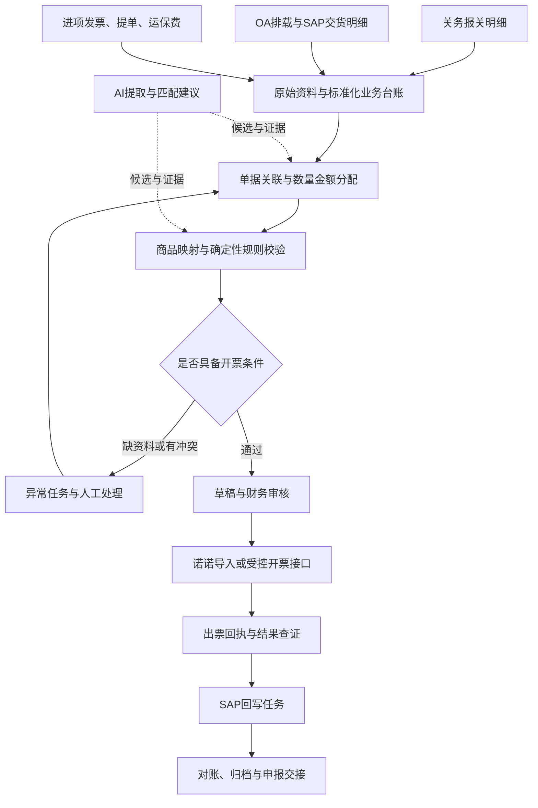

# 出口退税开票需求分析与实现方案

日期：2026-09-29。依据：用户提供的《纪要_09-23 出口退税开票自动化与信用证生成.md》及下列官方资料。

本文是需求分析和拟议实现方案，未接入企业关务、电子税务局、诺诺或 SAP，也未验证这些系统的接口能力。会议纪要是 AI 听记，本文将其中的意见、行动项视为待分析的业务材料，不视为系统操作授权或已核实的法规结论。

## 1. 建议结论与范围

建议建设“出口开票工作台”：以报关明细为开票核对主线，以 OA 排载和 SAP 交货明细建立关联，结合商品映射、日期证据和金额规则生成开票草稿；财务审核后交给诺诺开具，取得真实回执后反写 SAP，最终完成对账和归档。

项目的主要工作量在数据关联、业务规则和系统集成。AI 用于单据提取、候选匹配和异常解释；正式金额计算、状态转换、开票防重和凭证处理由确定性程序承担。

首期建议选择一个中国大陆法人、一般贸易、常用品类，覆盖自产出口及政策属性已确认的外购出口。实现资料导入、关联匹配、规则校验、诺诺开票文件、回执导入及 SAP 回写清单。优先用历史样本把闭环验证清楚，再接入自动采集和写接口。

信用证生成是另一条业务链，不纳入本次首期范围；纪要中的信用证数量浮动条款也不直接用于发票校验。越南主体、特殊监管区域、加工贸易、正式退税申报提交分别设后续范围。首期开票完成并不表示已满足全部退税条件，应向退税申报环节交付单据、差异及资料缺口。

## 2. 需求拆解

| 业务问题 | 系统需求 | 验收可见结果 |
| --- | --- | --- |
| 等关务通知，月末集中处理 | 定期获取新增和变更报关单，展示待开票任务及数据更新时间 | 每张关单都能看到处理状态、责任人和待补资料 |
| 交货单、关单和税票脱节 | 建立到明细行的关联及数量、金额分配 | 从任一税票反查全部相关交货行、关单行和分配依据 |
| 品名、规格、单位、编码不同 | 商品映射库、单位换算、AI 候选及人工定版 | 已审核映射可复用；冲突有原因且不能直接开票 |
| CIF/CFR 与 FOB 混用 | 分别保存成交金额、运保费、FOB、开票额及会计额 | 每个金额能追溯到来源、公式、汇率和版本 |
| 月底、年底数据延迟 | 分离业务日期、收入日期、开票日期与采集时间 | 有跨期例外清单，不以抓取日期代替业务日期 |
| 诺诺出票后仍人工记录 | 开票批次、出票回执、红冲关联、SAP 回写任务 | 能区分已出票、待回写、已回写、对账异常 |
| SAP 人民币金额有尾差 | 统一计算口径，识别舍入差与真实汇率差 | 差异可解释，凭证平衡，处理有财务批准依据 |

## 3. 必须澄清的业务口径

### 3.1 “出口发票”至少有四种不同含义

需要用实际样本确认：商业发票（Commercial Invoice）、诺诺开具的税务发票、SAP SD 开票凭证、SAP FI 会计凭证。它们的编号、币种、用途及产生时间不同，不能用一个 `invoice_no` 字段混装。

商业发票可能在报关前已作为基础单证生成。本方案所说“关务反向生成”，主要是指根据已确认的关务数据生成待开税票草稿和核对结果，不是要求所有商业发票必须等报关后才能生成。

票种、出口业务标识、税收分类编码及税率/优惠标识必须按实际业务和平台支持情况确认。不能把“免税”和“零税率”作为同一个开票配置。2026 年管理办法第五十四条规定，适用退（免）税的出口业务，除输入特殊区域的水电气外，不得开具增值税专用发票。[依据：国家税务总局公告2026年第5号](https://fgk.chinatax.gov.cn/zcfgk/c100012/c5247423/content.html)

### 3.2 自产与外购必须先分类

会议前段将生产企业都理解为“进项与出口成品完全一致”，后段又区分了自制和外购，应以业务分类重新形成规则。自产成品不能机械套用原材料进项发票的名称或编码；外购出口则需核实购进货物与出口货物的对应关系，以及是否满足视同自产等适用条件。

2026 年政策将生产企业自产、视同自产以及列名生产企业的非自产货物分别规定；非列名生产企业不符合视同自产条件的外购出口货物列入免税范围。因此，“外购件”不是可以自动判定免抵退的标签。[依据：2026年第11号公告第二条、第六条](https://fgk.chinatax.gov.cn/zcfgk/c102416/c5247437/content.html)

系统字段至少包括法人、生产/外贸主体类别、自产/外购属性、贸易方式、适用政策及生效版本。未确认政策的业务可进入资料整理，但不得自动判定可退税。

### 3.3 编码与单位要对应，不能直接等同

分别保存 SAP 物料号、海关商品编码、开票税收分类编码；退税率文库的商品代码及版本也单独管理。海关编码不能直接填入诺诺的税收分类编码字段，历史进项编码也不能未经验证就视为正确。

管理办法第二十三条要求报关单与申报退（免）税匹配的购进凭证商品名称、计量单位相符，并对多种零部件合并报关的相关性及单位折算书面报告作出规定。这不能简化成所有场景的字符串完全相同，也不能解释为任意近义词和单位换算都自动允许。[依据：2026年第5号公告第二十三条](https://fgk.chinatax.gov.cn/zcfgk/c100012/c5247423/content.html)

英文单位的标准化仅用于内部比较，原始数据必须保留；是否需要更正源票或提交说明由具体业务规则决定。长度和重量之间没有通用转换系数，纺织品米与千克的转换应取得产品或批次相关依据。

### 3.4 日期分开管理，提单提供证据

分别保存申报日期、海关出口日期、提单装船日期、入区日期、收入确认日期、开票日期、退税申报所属期以及各系统采集时间。

对于执行企业会计准则的主体，收入确认要根据合同履约及客户取得商品控制权判断。提单装船日可作为重要证据，但不能对所有贸易条件统一等同于收入确认日；公开班轮计划也不能单独证明具体货物已装船。[依据：财政部《企业会计准则第14号——收入》第四条](https://kjs.mof.gov.cn/zhengcefabu/201707/P020170719328747835611.pdf)

建议将年度截止核验扩展为每月都适用的控制，年底提高复核级别。数据未及时到达时，进入“证据待补/跨期处理”队列，收入处理与开票安排分别审核，不倒填票据日期、不用预测日期替代实际日期。

### 3.5 “进入保税仓即退税”不是通用规则

2026 年政策对报关进入国家批准特殊区域并销售给指定对象的货物列有视同出口规定，同时也区分保税区及经保税区出口的其他处理。不能仅根据地点名称带“保税”自动确定退税资格或适用日期。[依据：2026年第11号公告第一条、第三条、第九条](https://fgk.chinatax.gov.cn/zcfgk/c102416/c5247437/content.html)

需要核实准确区域类型、监管方式、销售对象、单证种类和企业是否属于相关试点。纪要的“一线/二线”“退税联/收汇联”先映射到实际系统字段和样本，再实施专门的规则配置。

### 3.6 一致性应在同一业务口径下校验

生产企业相关业务的计税依据为实际 FOB；免抵退申报离岸价与报关单离岸价不一致时，管理办法第二十一条要求报送差异原因说明。因此，系统应比较同口径金额并保留差异原因，不能用“关单等于发票”强行覆盖真实成交及调整数据。[政策依据](https://fgk.chinatax.gov.cn/zcfgk/c102416/c5247437/content.html)、[管理依据](https://fgk.chinatax.gov.cn/zcfgk/c100012/c5247423/content.html)

红字税票、商业贷项通知和退税申报负数调整是不同对象。发生退货、折让或计税依据变化时，要判断分别影响哪些对象；原票和原申报记录保留，调整通过关联的新记录完成。管理办法第二十九条规定了已办理退（免）税业务发生销售折让、中止、退回或计税依据变化的申报调整要求。[依据](https://fgk.chinatax.gov.cn/zcfgk/c100012/c5247423/content.html)

## 4. 目标流程与架构



建议技术结构采用业务服务、关系数据库、原始文件存储、持久化任务队列、系统适配器、AI 服务和人工工作台。首期可采用模块化单体，连接外部系统的任务独立执行，不必一开始拆成大量微服务。

AI 输出结构化候选和来源位置，不直接持有开票或 SAP 过账权限。审批、金额计算、状态及系统回执保存在业务数据库，不能依赖聊天记录或提示词维持账务状态。

## 5. 数据接入与来源责任

| 数据源 | 关键字段 | 使用方式 |
| --- | --- | --- |
| 关务/单一窗口或企业关务系统 | 法人、关单号、项号、监管方式、商品编码、品名规格、成交及法定数量单位、币种、金额、贸易条款、日期、运保费、修撤状态 | 开票核对主线；具体字段以导出样本确认 |
| OA 排载 | 排载号、交易单号、交货单号/行号、提单号、关联关单号 | 提供跨系统显式关联，优先于模糊匹配 |
| SAP | 公司代码、销售订单、交货单/行号、物料、数量、币种、SD/FI 凭证、金额及既有税票号 | 业务核对和回写对象，避免重复创建凭证 |
| 进项发票 | 票号、行号、供方、商品名称、规格、单位、数量、金额、税收分类编码（如能获取）、发票状态 | 外购对应检查及历史编码候选 |
| 提单/物流证明 | 提单号、船名航次、装船日期、货物信息、签发/修订状态 | 日期证据及关单关联 |
| 运保费资料与汇率表 | 费用项目、覆盖批次、金额、币种、适用汇率、日期和审批依据 | FOB 还原、费用分摊、折算 |
| 诺诺 | 开票申请号、实际票号、票种、日期、金额、状态、红蓝票关联、回执文件 | 实际开票结果的事实来源 |

没有一个系统对全部字段都具有优先权：运输事实看有效运输证据；税票状态看开票回执；会计凭证状态看 SAP；金额转换看经批准的口径及原始费用依据。冲突进入异常处理，禁止按“最后采集的数据”直接覆盖已审结果。

纪要倾向 RPA，首期可保留该路线，但应先检查现有诺诺-SAP 接口和标准导出能力。建议文件导入用于原型，稳定的已有接口用于自动化，缺乏接口的环节采用有人值守 RPA。验证码/短信验证转授权人员完成，任务保存断点；会话过期、页面变化和字段缺失时停止该批次并提示，不能伪装成采集成功。

采集器需要增量水位、可配置回看窗口和周期全量核对，以识别迟到数据、关单改单、票据红冲。原件保存来源、采集时间、文件摘要和版本，不覆盖历史原件。

## 6. 单据关联与商品映射

### 6.1 单据关系支持多对多

纪要同时提到“多交易单合并一行”及“一票对一票”，实际模型必须支持多个 SAP 交货行对应一个关单行，一个关单行因票面限制拆为多个税票行，以及一笔费用跨多张关单分摊。

建立明细分配表，至少保存：法人、交货行、关单行、税票行、分配数量、单位、分配金额、币种、匹配依据、版本、审核人和状态。进项发票与外购出口明细另建关联，不强行要求每个自产成品行都有一张对应原材料进项票。

关联顺序：显式交货行/交易单编号 → OA 已确认映射 → 经验证的组合键 → 候选匹配并人工审核。组合键可以包含客户、合同、物料、币种、数量、金额和日期窗口；名称相似或金额相同不能单独成为自动匹配条件。

同一关单行的有效开票分配不能超过可开数量/金额；同一交货行不能被重复分配。草稿批准时原子预留，确认开票失败时释放；开票结果未知时保留预留。部分红冲依据实际回执调整占用，不能一键释放整张原票。

### 6.2 商品映射采用“已审规则优先，AI 推荐补缺”

优先顺序：企业已审核物料映射 → 同商品的历史已确认映射 → 当前有效编码目录检索 → AI 对候选作排序、给出证据 → 财务/商品归类人员确认。

映射记录包含物料、商品属性、海关编码、开票分类编码、规范品名规格、原始与标准单位、换算依据、业务适用范围、生效区间及审批版本。编码或商品属性变化时重新校验。

AI 必须从可用目录选择候选，不生成不存在的编码；置信度不能覆盖缺失成分、用途或加工状态等事实。新商品和冲突映射必须人工审核。低置信度任务返回缺失资料，不猜测。

### 6.3 补米与数量差异

同时保留订单计价数量、SAP 发货数量、实际报关数量和法定计量数量。补米先判断是合同内附送、质量补偿、另批补发还是样品，再决定金额和票据处理。

示例（假设经业务确认）：合同 1,000 米、总价 USD 10,000，实际同批报关 1,100 米且成交总额不变。用于该开票口径的单位价格可据 USD 10,000 ÷ 1,100 计算；不能继续用原单价 USD 10 导致金额变成 USD 11,000，也不能修改 SAP 原始订单数量。最终票面精度和数量取值需以已确认的票种及开票平台规则为准。

数量允差只用于发现异常和分流复核，不自动修改事实。纪要中的“长度、重量可浮动”“台、套不浮动”不能直接实现成全局 ±5% 校验开关。

## 7. 金额、FOB 和 SAP 尾差

### 7.1 多金额口径并存

分别保存成交金额、报关申报金额、FOB 原币金额、FOB 人民币金额、税票金额、SAP 原币金额和 SAP 本位币金额。每次核对明确币种、费用是否包含、金额是否含税、汇率日期和舍入规则。

在费用归属、计价币种等均确认的简化场景中：

```text
FOB = CIF成交金额 − 应扣国际运费 − 应扣保险费
FOB = CFR成交金额 − 应扣国际运费
目标人民币金额 = 按该业务口径确定的原币金额 × 经批准的适用汇率
```

公式不是所有贸易条件的完整规则。费用未取得或有估计成分时明确标记，是否允许形成草稿及如何后续调整由财务定义。不同币种的运费不能直接相减，先依相应口径折算。

示例：CIF USD 100,000，适用扣除运费 USD 3,000、保险费 USD 200，则 FOB USD 96,800；若示例折算率为 7.10，FOB 折合人民币 687,280.00 元。这不意味着应收账款、商业发票或每种税票票面总额都应自动改成 687,280.00 元。

费用按合同约定或经批准的重量、体积、货值等基础分配，并保留计算明细。使用十进制定点计算，统一精度和舍入顺序；确属舍入的末行分配也要单独留痕。

### 7.2 将“强平”改写为可审计的金额一致性要求

业务目标可以定义为：同一口径、同一范围内 SAP 收入金额与税票核对金额一致；差异都能解释，处理后凭证借贷平衡、币种记录完整。

实施顺序：

1. 先核实比较对象。收入净额、应收总额、FOB 申报金额不一定是同一口径，不能直接强求三者相同。
2. 对齐汇率来源/日期、单价精度、逐行与汇总舍入顺序，优先消除计算路径差异。
3. 将差异分类为舍入、汇率、运保费、折让、数据错误；只对经过验证的舍入差按批准规则处理。
4. 在 SAP 测试环境验证现有 SD/FI 流程能否接收所需本位币金额或受控舍入调整，验证借贷双方、税额、平行货币及后续清账影响。
5. 已过账凭证通过获准的更正/冲销流程处理，不直接修改数据库或消除审计痕迹。真实汇兑差异不作为尾差抹去。

具体字段、增强点和容差由 SAP 版本、凭证类型及财务配置决定，目前不能认定存在可以直接启用的通用“强平开关”。建议把该项作为独立的 SAP 技术验证任务，并在报价中单独估算。

## 8. 诺诺开票、状态与可靠性

业务状态和外部动作分别管理：

```text
业务：待补资料 → 待匹配 → 待校验 → 待审核 → 已批准
开票：未提交 → 提交中 → 已开具 / 明确失败 / 结果待查
回写：未开始 → 回写中 → 已回写 / 回写失败
核对：待核对 → 一致 / 有差异
调整：红冲申请 → 红冲结果待查 → 已部分红冲 / 已全部红冲
```

审核绑定数据摘要及规则版本。审批后品名、金额、数量、汇率、映射或来源版本变化，原批准失效并重新计算审核。

开票申请持久化唯一业务键，包含法人和固定的开票批次/分配版本；同键重复请求复用结果，同键不同内容拒绝。发送任务与业务状态通过可靠任务表或事务发件箱衔接，工作进程可在重启后恢复。

调用诺诺超时时不能直接重开。先按申请号查证实际开具状态；平台无法提供确定查询时转人工查证。在确认开具失败前，保持“结果待查”和数量金额预留。

诺诺已出票但 SAP 回写失败时，只重试回写。SAP 回写也使用稳定的外部关联键防重，保存公司代码、交货行、SD/FI 凭证与税票的关联。是否写回交货单、开票凭证扩展字段或独立关联表，通过 SAP 样本和现有集成确定；多张税票不能塞进一个只支持单值的字段。

文件导入路线同样保存导出批次、文件摘要、行号及回执，防止用户重复导入同一批。若平台没有防重能力，人工查证是该路线的实际边界。

## 9. 工作台、角色与核心数据对象

建议设置六个工作区：待开票清单、单据关联、商品映射、开票草稿审核、异常处理、开票/SAP 对账。任务页面能够并列显示原始资料与计算结果，并能定位到单据行或原文页。

角色职责：关务确认关单及修撤；业务确认合同、补米和关联；财务确认票种、税务口径、汇率及开票草稿；SAP 财务顾问确认入账和尾差方式；技术运维处理采集与接口故障。权限按租户、法人及职责校验，已审规则变更保留记录。

建议的核心实体：

| 实体 | 主要职责 |
| --- | --- |
| `source_document` / `source_version` | 原始资料、来源、摘要、位置和版本 |
| `export_case` | 法人、业务类别、合同、各日期及总体状态 |
| `customs_declaration` / `customs_line` | 报关头行数据及修撤历史 |
| `delivery_line` / `purchase_invoice_line` | SAP 交货及进项凭证标准化快照 |
| `document_allocation` | 跨系统行级关系、数量金额分配和占用 |
| `product_mapping` / `unit_conversion` | 经审批的商品映射、单位换算 |
| `rule_version` / `calculation_snapshot` | 适用口径及每次计算明细 |
| `invoice_draft` / `invoice_request` / `invoice_receipt` | 草稿、批准版本、请求及实际税票 |
| `integration_job` / `sap_link` | 外部动作、重试、结果查证和 SAP 关联 |
| `exception_case` / `approval_record` | 责任人、处置理由、依据与审核记录 |

所有关联带法人/租户边界。审批内容、编码选择、规则版本、开票回执和改动前后值应可追溯。原始单据与供应商发票不因内部标准化而被修改。

## 10. 与当前 rsmagent 的结合方式

根据当前项目场景文档，可复用场景智能体的入口、技能组织、文件资料处理思路，并评估复用现有身份与授权能力。本文未对当前运行版本作完整集成审计，不能据此认定已具备出口开票连接器或可靠的财务事务执行能力。

建议新增一个出口开票场景，由智能体调用受控业务工具，例如查询待开票项、读取关联证据、推荐映射、生成草稿及解释差异。开票工作台、金额引擎、审批状态、诺诺适配器和 SAP 适配器属于新增业务模块。

首期只做到“数据导入→分析与草稿→人工审核→导出/回执核对”，便于在现有平台快速验证。后续在身份隔离、可靠任务、接口查证及审批校验完成后接通写操作。既有聊天运行记录不能直接替代财务业务账本。

## 11. 分期计划与交付

以下是工作分解估算，不是已确认工期。假设一个法人、资料及时、既有系统允许导出，并可获得诺诺及 SAP 厂商配合；建议配置业务/产品 1 人、后端与集成 2 人、前端 1 人、测试 1 人，财务、关务和 SAP 顾问按需投入。外部接口开通、采购和等待审批时间另计。

| 阶段 | 建议用时 | 交付与退出条件 |
| --- | --- | --- |
| P0：样本与口径验证 | 1–2 周 | 真实样本清单、单据关系、政策分支、开票模板、SAP 尾差验证结论；确认主要关联字段可获得 |
| P1：人工审核的 MVP | 3–4 周 | 文件导入、行级关联、映射库、FOB/汇率计算、异常任务、草稿审核、诺诺导入文件、回执导入、SAP 回写清单；用历史及试点数据对账 |
| P2：在线闭环 | 3–5 周 | 接入采集、诺诺实际接口和 SAP 回写，补超时查证、幂等、重启恢复及日常对账；覆盖典型故障演练 |
| P3：范围扩展 | 单独估算 | 特殊区域、加工贸易、多法人、越南当地业务、自动申报及信用证分别立项 |

上述阶段顺序执行时，P0+P1 约 4–6 周，至 P2 约 7–11 周。RPA 多站点适配、SAP 定制增强、接口权限及政策待确认项可能显著影响时间；先完成 P0 再固定预算。

## 12. 验收场景与指标

至少覆盖：自产 FOB、自产 CIF/CFR、外购且政策已确认、一个关单对应多个交货行、一个关单行拆票、补米、单位转换、跨年迟到数据、关单改单、部分红冲、重复导入、诺诺超时但已出票、SAP 回写失败、服务重启恢复、真实汇率差与舍入差区分。

建议在 P0 确认验收集、指标分母和目标值，避免将演示准确率作为生产承诺：

- 关键字段（法人、票种、金额、币种、数量、单位、编码、日期）在冻结验收集内与财务签认结果逐项一致。
- 正常已批准样本中，自动生成无需修改草稿的比例可先以 80% 为讨论目标；新物料和异常样本单独统计，不能为了提高比例绕开复核。
- 每张已开税票都能追溯来源单据、分配明细、规则版本、审批及实际回执。
- 重复请求、超时和重启演练不得产生重复开票或重复 SAP 入账；结果不明必须进入待查状态。
- 同口径金额按明确舍入规则核对；所有剩余差异有记录、责任人和处理结果，不通过隐藏差异达标。
- 采集故障、缺资料、编码冲突和政策未确认都能被识别，并进入对应责任人的处理队列。
- 衡量每票人工操作时长、月末未处理数量、错误开票率和异常平均处理时长；先采集现状基线，再评估改善。

## 13. 启动实施需要的材料与决策

1. 明确首期法人、实际退（免）税办法，以及自产、外购、视同自产、加工贸易和特殊区域的业务占比。
2. 提供脱敏的真实全链路样本，建议 30–50 组，覆盖关单、商业发票、进项票、OA 排载、SAP 交货/SD/FI 凭证、诺诺税票及提单；至少包含补米、CIF、跨年、红冲和尾差。
3. 确认“出口发票”“增值税票号”“交易单号”在当前流程中的具体含义，提供诺诺模板、必填项、备注要求和成功回执。
4. 确认关务系统具体产品、二线数据查询路径、OA 导出/接口字段、电子税务局发票数据的实际可得字段。
5. 确认 SAP 版本、公司代码、本位币、SD/FI 链路及现有诺诺接口，明确税票回写对象和会计凭证是否已自动生成。
6. 财务签认日期判定、费用分摊、汇率选取、票面金额口径和舍入差处理规则；特殊区域与外购资格提供适用依据。
7. 明确单据量、并发、月末峰值、人工审核角色及故障处理时限，确定先用文件导入还是立即接入接口。

优先验证两件事：OA/SAP/关务之间是否存在可靠的明细关联，以及诺诺实际开票口径与 SAP 入账口径能否解释一致。两者通过后，AI 匹配和 RPA 才能稳定放大效率。
