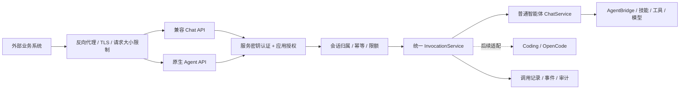

# 智能体对外调用改造方案与评估

评估日期：2026-09-24。代码基线：rsmagent `6a8ebccd`；本机 BuildingAI `b28af72a`。

本文为方案评估，不代表已经完成改造。范围默认是 ERP、OA、自研业务后端和其他 AI 平台通过服务端接口调用普通智能体。Coding/OpenCode 智能体、外部员工身份委托、跨实例高可用分别评估。

## 1. 结论

项目已经有对外调用的核心实现：`POST /v1/chat/completions`、服务账号密钥、普通智能体执行、同步和 SSE 返回。建议在现有 Python 服务中补齐接入与治理，复用既有身份库、RBAC、凭据和执行链。

当前还不能直接作为完整、稳定的外部接入产品交付。最优先的问题是正式 HTTP 入口未接通服务密钥鉴权，其次是调用方会话隔离、消息语义和密钥管理入口。完成这些后，再增加按智能体发布、应用授权、调用额度和异步任务。

建议分两层交付：

- **兼容调用接口**：保留 `/v1/chat/completions`，供已经支持兼容协议的客户端接入。
- **原生任务接口**：提供 `/api/open/v1/agents/{agent_id}/runs` 等接口，表达智能体的执行状态、工具审批、文件结果和长任务。

两层共用一个经过授权的执行服务，避免鉴权、会话、取消和执行行为分叉。

## 2. 现状及验证

| 能力 | 当前实现 | 评估 |
| --- | --- | --- |
| 对外 HTTP 接口 | `channel/web/openai_api.py` 实现 `/v1/chat/completions` | 可复用，但正式应用入口存在鉴权阻塞 |
| 完整智能体执行 | `_run_chat_service → ChatService.run → AgentBridge → AgentStreamExecutor` | 包含智能体提示词、工具、技能与会话执行，不是简单转发模型接口 |
| 服务账号密钥 | `IdentityService` 支持 `sak_` 密钥创建、列表、轮换、撤销和认证 | 已绑定真实用户和租户，复用价值高 |
| 权限体系 | `chat.use`、租户绑定、`agent.use` 及下游模型等资源权限 | 应继续沿用，并叠加应用与发布范围 |
| 返回方式 | 同步 JSON、SSE、断流取消、工具扩展事件 | 可以作为基础；还缺完整任务契约和统一超时 |
| 会话选择 | `conversation_id`，其次 `user`，否则一次性会话 | 必须补充调用方命名空间和会话归属检查 |
| 模型/智能体选择 | `X-Agent-ID` 选择智能体；`model` 只校验并回显 | 不能据此声称支持按 `model` 路由智能体 |
| 历史消息 | 只提交 `messages` 中最后一条非空 user 消息 | 完整无状态多轮消息语义尚未实现 |
| 密钥产品入口 | 找到服务层与测试；未发现专用管理路由/页面调用这些服务方法 | 文档所述“控制台创建密钥”与实现接线需要补齐 |
| 执行记录 | 已有 `runs` 辅助表及内部记录机制 | 不能直接视为持久化任务队列；部分记录失败允许继续运行 |
| Coding 智能体 | 独立 Web/OpenCode 入口，普通初始化器明确拒绝 | 需要单独适配器 |
| 多进程 | 正式 Web 工厂拒绝检测到的多 worker 配置 | 第一阶段按单实例设计，横向扩展另行改造 |

### 已复现：服务密钥在正式入口被拒绝

使用临时身份库签发同一个有效 `sak_` 密钥，绑定同一个租户和智能体，模型执行使用替身：

| 请求路径 | 结果 | 是否进入执行替身 |
| --- | --- | --- |
| 仅装配 `OpenAIChatCompletionsHandler` | `200 OK` | 是 |
| 使用正式 `build_web_app()` 工厂 | `401 Unauthorized` | 否 |

原因：`route_registry.py` 把该接口登记为 `tenant`；`auth/http_policy.py` 在 Handler 之前按网页登录会话解析 Bearer，而 `sak_` 解析逻辑在 Handler 内，来不及执行。没有租户头时还可能先触发缺少租户选择的拒绝。

这属于代码接线问题。应让路由声明明确选择服务密钥解析器，再进入统一授权；不能通过改成匿名路由或全局关闭鉴权解决。

### 会话隔离：需要优先修正的代码风险

`_request_values()` 直接把外部 `conversation_id` 或 `user` 转成内部 session ID，未包含租户、应用或认证用户；`AgentBridge._runtime_key()` 又只使用 `(agent_id, session_id)`。API 路径未复用 Web 消息入口的原子归属声明。

因此，不同调用方在同一智能体上使用相同外部会话标识，会得到相同运行时缓存键，存在上下文混用风险。身份库和持久化查询的过滤不能替代运行时缓存隔离。这里是代码层面的风险定位，本次没有使用真实用户会话进行串读测试。

### 已运行的检查

```text
.venv/bin/python -m pytest tests/test_service_account_api_access.py \
  tests/test_openai_chat_api.py tests/test_http_policy.py -q -p no:randomly
78 passed in 4.42s
```

现有接口测试多采用仅装配 Handler 的应用，因此通过并不能证明正式路由和服务密钥已经接通。此次验证使用临时数据库和执行替身，未进行真实模型、外部业务系统或吞吐压测。

## 3. BuildingAI 可参考的设计

本次参考的是本机项目代码，不将其等同于所有上游版本。

| BuildingAI 的实际做法 | 对本项目的建议 |
| --- | --- |
| `AgentPublicAccess` 声明对外路由；中间件将 `/v1/chat-messages` 等别名转到智能体服务 | 借鉴明确的公开接口清单；本项目使用独立 Handler + 共用执行服务，避免复制 Web 请求环境 |
| API Key/站点令牌关联智能体，记录认证来源、智能体和租户 | 保留可信来源标记，增加独立应用身份、可访问智能体清单 |
| 公开别名入口检查市场发布审核状态 | 借鉴显式发布开关；企业私有 API 发布可独立于市场上架，避免业务耦合 |
| `responseMode` 区分 blocking/streaming，并提供会话、停止等接口 | 提供稳定的同步/SSE/异步契约和可寻址的执行记录 |
| 存在版本快照、生产发布与草稿机制 | 分阶段引入发布修订与配置快照，明确线上配置变化的生效时点 |
| 独立 Console MCP 密钥支持标签、指纹、撤销、最近使用时间，明文只在创建时返回 | 借鉴管理体验；该模块与智能体发布密钥不是同一套功能，不能混为已有统一能力 |

不宜直接照搬的地方：

1. 当前 BuildingAI 公开鉴权会把智能体创建人放入 `request.user`，再附加来源上下文。本项目已经有真实服务账号，应沿用服务账号的最小权限，避免外部调用默认借用创建者身份。
2. 其鉴权路径仍兼容历史明文发布字段。本项目可复用现有加密凭据，无需新增明文配置。
3. 本机版本保留 `enableApiKey/apiKeyHash` 的鉴权，但检查到的 `UpdatePublishConfigDto` 仅开放站点开关、复制和站点令牌重置；不能假定已有完整的智能体 API Key 管理页面和生命周期。
4. 本次检查到的智能体公开入口不能证明已具备完整的按应用限流、额度和持久化异步执行；这些要按本项目需求实现、验收。

## 4. 目标结构与边界



首期沿用现有 Web 服务和 Python 技术栈。外部代理仅转发开放接口路径；控制台仍通过自身管理入口访问。是否拆分 API 进程，应由压测和部署隔离要求决定。

### 4.1 身份：应用与服务账号组合

- 一个外部应用绑定一个租户和一个普通服务账号；支持同一应用多把密钥，以便不同环境接入和轮换。
- 复用 `credentials`，增加密钥与应用的关联、到期时间、标签和最近使用时间，不另建平行的密钥加密体系。
- 对新开放应用禁止绑定平台管理员/租户管理员作为默认执行身份，分配所需业务资源权限。
- 实际权限取交集：应用 scope、发布允许范围、服务账号当前 RBAC/资源权限。权限判定失败或身份服务故障直接拒绝。
- `tenant_id` 从密钥确定。请求中的租户字段不能改变执行租户；`agent_id` 必须在授权和发布清单内。
- `external_user_id` 只用于调用方内部用户的会话隔离和审计，不能直接转换为本平台员工权限。
- 若需“以 ERP 当前员工身份执行”，增加可验证的身份绑定/令牌委托，单独评估。
- 扩展可信运行上下文，携带 `application_id`、`credential_id` 和来源；跨线程/子任务传递，执行关键动作时重验权限与凭据有效性。

密钥轮换只改变凭据，不改变稳定的应用身份和会话归属。关闭应用、撤销密钥或取消授权后，后续请求和尚未开始的任务应被拒绝；在途任务在下一个受控工具动作前重验，支持协作取消。

### 4.2 会话：服务端生成 ID，明确状态模式

- 内部会话由服务端创建，并原子记录 `tenant + application + service_user + external_user + agent` 的归属。
- 外部业务会话号通过映射表关联内部会话；所有读、续聊、事件、文件、取消操作按同一归属校验。
- 缓存键、执行锁和取消键全部采用完成隔离的内部会话标识；未知归属不能通过第一次读取自动认领。
- 同一用户支持多条会话，取消当前把 `user` 当唯一会话标识的默认做法。
- **无状态兼容模式**：完整处理支持的消息历史，运行后不自动延续上一请求的上下文。外部 system 消息不能覆盖服务端智能体安全和工具策略。
- **有状态原生模式**：携带 `conversation_id` 仅追加本轮输入，由服务端维护历史。请求不得同时重复导入完整历史，避免双重累积。
- 对旧接口的有状态语义保留明确的兼容策略；新应用默认采用新契约，迁移现有调用方后再停用旧语义。

### 4.3 发布：控制哪些智能体可被外部使用

为智能体增加“API 发布”配置：启停、对外别名、允许应用、输入/输出约定、允许的工具、超时和并发策略。

第一阶段至少有显式启停和修订号。要承诺“发布后稳定”，执行器必须真正读取发布配置快照；只保存版本号、仍读取可变的 Agent 当前配置不算版本固定。技能文件、知识内容和外部工具依赖的完整版本化列入后续阶段。

对高影响工具，首期使用服务账号权限和开放策略显式限制。需要人工确认的工具应返回可识别的 `approval_required`，不能因为没有 Web 弹窗而自动批准；后续任务接口增加审批续行能力。

### 4.4 接口建议

以下为拟议接口，除现有聊天接口外均需要新增。

| 接口 | 用途 | 阶段 |
| --- | --- | --- |
| `POST /v1/chat/completions` | 兼容文本问答，支持同步/SSE | P0 修复，P1 补足契约 |
| `GET /v1/models` | 列出调用方可用的智能体发布别名和最小能力说明 | P1 |
| `GET /api/open/v1/agents` | 查询被授权且已发布的智能体 | P1 |
| `POST /api/open/v1/agents/{agent_id}/runs` | 发起普通智能体调用，返回结构化执行标识 | P1 同步/SSE，P2 异步 |
| `GET /api/open/v1/runs/{run_id}` | 查询持久化状态及结果 | P2 |
| `GET /api/open/v1/runs/{run_id}/events` | 按事件序号订阅、断线续传 | P2 |
| `POST /api/open/v1/runs/{run_id}/cancel` | 归属校验后的协作取消 | P2 |
| `POST /api/open/v1/files`、`GET /api/open/v1/files/{file_id}` | 上传输入文件、下载结果文件，均校验归属 | P2 |

应用、密钥和发布的管理接口放在既有租户管理域下，开放调用密钥没有管理权限。

新契约中 `model` 可表示已发布智能体别名，底层模型由发布配置控制。兼容旧调用时保留其现有 `X-Agent-ID` 选择语义；新契约若同时指定别名与 header，必须一致。明确支持的字段，对不支持的 `tools`、多模态或生成参数返回清晰错误，避免静默忽略。

原生调用请求示意：

```http
POST /api/open/v1/agents/quote-assistant/runs
Authorization: Bearer <service-key>
Idempotency-Key: erp-quote-20260924-001
Content-Type: application/json

{
  "input": "根据本次询价生成报价建议",
  "external_user_id": "erp-user-1024",
  "external_conversation_id": "rfq-20260924-001",
  "response_mode": "streaming",
  "metadata": {"business_type": "rfq", "business_id": "RFQ-001"}
}
```

响应统一带 `request_id/run_id/conversation_id/agent_id/revision`；输出包含答案、受控文件引用、usage 和结构化错误。工具执行进度使用白名单事件，不默认透传原始工具参数、结果、内部路径或 reasoning。

### 4.5 可靠性与治理

- **限流与并发**：按应用、租户、智能体设置速率和在途上限，同时限制请求体、消息长度、工具轮数和总运行时间。排队也计入截止时间。满载返回 `429` 和重试提示。
- **幂等**：以应用、接口、幂等键建立唯一约束并记录规范化请求摘要；同键同请求复用执行，同键不同请求返回 `409`。保存期应覆盖业务系统的重试窗口。
- **异步任务**：先持久化接收记录，再投递；队列和领取使用租约/原子状态更新。`queued/running/awaiting_approval/succeeded/failed/cancelled/timed_out/interrupted` 状态要有明确终态规则。
- **重启处理**：现有 `runs` 为辅助记账，SSE/执行状态部分在内存，需补可靠记录。进程重启后先对账；外部写操作完成情况不明时标记中断并人工确认，不能盲目重跑。
- **副作用**：请求幂等不等于工具副作用的 exactly-once；创建订单、发送消息等工具还需要下游业务幂等键或执行回执。
- **超时与取消**：区分排队、首事件、空闲和总时长；同步/SSE 断连可取消，异步任务继续执行，显式取消为尽力协作停止。
- **计量与审计**：记录应用、租户、账号、智能体、修订、耗时、状态、模型调用和工具调用；聚合整个 Agent 多轮执行的 usage。额度检查和预留必须原子完成，不能只在结束后累加。
- **结果交付**：文件使用受控 `file_id`；大结果不直接塞入回调。Webhook 后续可选，使用签名、事件去重、重试和受控目标地址。
- **错误契约**：统一 `400/401/403/404/409/429/502/503/504`；SSE 已发响应头后用结构化错误事件表达失败。身份/授权异常和模型运行异常分别映射。

## 5. 代码改造落点

| 位置 | 改造内容 |
| --- | --- |
| `channel/web/route_registry.py`、`auth/http_policy.py` | 声明 API 认证策略，与方法/路由完整性校验统一接通 |
| `channel/web/openai_api.py` | 修复接入、会话和历史语义，增加能力白名单、稳定错误和输出投影 |
| `auth/service.py`、`auth/store.py`、`auth/runtime.py` | 复用服务密钥和凭据；增加应用关联、有效期、scopes、审计和可信身份来源 |
| `common/runtime_identity.py` | 传递应用和凭据归属，支持执行边界重验 |
| 新增 `agent/invocation/` | 提取统一执行服务，包装既有 `ChatService`，集中处理授权、会话、执行标识和受控事件 |
| `agent/chat/service.py`、`bridge/agent_bridge.py` | 与隔离后的会话键衔接；补 usage、结果和受控运行生命周期 |
| `agent/memory/conversation_store.py` | 复用会话存储；按需要补应用归属映射及可靠任务关联 |
| 新增开放 API Handler 与管理页 | 应用、密钥、智能体发布、调用记录、接入示例 |
| 路由能力声明、现有验收测试 | 覆盖生产工厂完整请求链，补身份隔离、撤权和恢复验收 |

建议数据实体为 `api_applications`、`agent_api_publications`、`api_conversation_bindings`、`api_invocations`；凭据继续使用 `credentials`。是否给内部 `runs` 扩字段，需在实施设计时明确事务边界：开放调用接收记录必须可靠，内部辅助运行记录可通过关联 ID 接入，避免两边各自维护冲突的任务状态。

## 6. 分期和工作量

估算以熟悉现有代码的开发者为前提，包含开发、必要页面、回归和接入文档，不含第三方系统自身改造及等待联调。均为人日，后两阶段是增量。

| 阶段 | 交付范围 | 估算 |
| --- | --- | --- |
| P0：受控内网接入 | 正式入口 SAK 修复；服务账号/密钥最小管理入口；调用方会话隔离；接口能力说明；基础并发/超时/输出限制；完整链路测试 | 4–6 人日 |
| P1：正式对接版 | 应用与授权管理；智能体 API 发布；共用执行服务；兼容消息语义与智能体发现；同步/SSE 原生接口；幂等、审计计量、额度、文档及接入验证 | 另 10–15 人日 |
| P2：长任务与恢复 | 持久化异步任务/事件；查询取消；文件；审批续行；重启对账；按需 Webhook | 另 10–15 人日 |
| 可选：Coding/OpenCode | 复用开放认证，接入独立运行、事件、审批、工作目录与产物归属 | 另 5–8 人日，需确认上游能力 |
| 可选：多实例 | 分布式限流/锁、状态共享、队列调度、存储和部署策略 | 另 10–20 人日，压测后细化 |

正式对接版 P0+P1 合计 **14–21 人日**。按 1 名后端、部分前端/测试投入，约 3–4 周较稳妥；若只有 1 人包办则按总人日安排。计划排期再预留 20%–30% 的集成余量，重点覆盖现有授权链与执行服务抽取。

关键依赖是会话命名空间和统一认证上下文，应先定下来，再并行实现页面和接口适配。业务强依赖上传文件、异步批处理或人工确认时，需要把相应 P2 内容前移，不能按纯文本 P1 的范围估算。

## 7. 验收标准与主要风险

1. 使用正式 `build_web_app()` 和真实临时身份库：有效服务密钥成功，缺失/撤销/过期密钥失败；不经过网页登录也可完成调用。
2. 两个租户、两个应用、两个服务账号采用相同外部会话号，缓存、上下文、文件、事件和取消互不影响；同一应用换密钥后可继续其原会话。
3. 权限不足或已撤权的智能体、模型、技能和工具都拒绝执行；子任务不能放大授权范围。
4. 验证完整多轮消息语义；验证有状态续聊不重复导入历史；不支持的字段有明确响应。
5. 发布关闭立即阻止新调用；固定修订的执行读取对应配置；运行记录可追溯实际修订。
6. 重试同一幂等请求只产生一个逻辑执行；并发重复请求和同键不同内容有确定结果。
7. 验证慢客户端、排队超时、首事件超时、执行超时、断流、取消和进程重启行为。
8. 外部响应和普通调用日志不包含密钥、原始内部路径或未授权的工具信息；usage 覆盖一次智能体任务的多轮模型调用。
9. 压测后再给出并发/吞吐承诺；重点测长连接占用、Agent 内存、SQLite 写入和模型配额，而非只测轻量 HTTP 接口。

风险最高的是认证接线、会话隔离和带副作用任务重试。权限体系和执行链可以复用，整体可行性高；生产化复杂度主要来自身份、状态和治理，而非新增一个 HTTP 路由。

## 8. 证据索引

- 本项目接口和会话解析：[openai_api.py](/Users/jiantan/ai_assistant/rsmagent/channel/web/openai_api.py:53)
- 本项目 API 身份和 Agent 选择：[openai_api.py](/Users/jiantan/ai_assistant/rsmagent/channel/web/openai_api.py:468)
- 正式路由：[route_registry.py](/Users/jiantan/ai_assistant/rsmagent/channel/web/route_registry.py:231)
- 正式应用工厂：[web_channel.py](/Users/jiantan/ai_assistant/rsmagent/channel/web/web_channel.py:810)
- 服务密钥生命周期：[service.py](/Users/jiantan/ai_assistant/rsmagent/auth/service.py:7283)
- 会话运行时缓存键：[agent_bridge.py](/Users/jiantan/ai_assistant/rsmagent/bridge/agent_bridge.py:1064)
- Web 会话归属实现：[chat.py](/Users/jiantan/ai_assistant/rsmagent/channel/web/fork/handlers/chat.py:61)
- 普通智能体执行入口：[service.py](/Users/jiantan/ai_assistant/rsmagent/agent/chat/service.py:30)
- Coding 边界：[coding/__init__.py](/Users/jiantan/ai_assistant/rsmagent/agent/coding/__init__.py:1)
- BuildingAI 对外别名和发布门槛：[agent-alias-rewrite.middleware.ts](/Users/jiantan/ai_assistant/buildingAI/packages/api/src/modules/ai/agents/middleware/agent-alias-rewrite.middleware.ts:14)
- BuildingAI 对话入口：[agent-chat.controller.ts](/Users/jiantan/ai_assistant/buildingAI/packages/api/src/modules/ai/agents/controllers/web/agent-chat.controller.ts:124)
- BuildingAI 发布管理字段：[update-publish-config.dto.ts](/Users/jiantan/ai_assistant/buildingAI/packages/api/src/modules/ai/agents/dto/web/publish/update-publish-config.dto.ts:3)
- BuildingAI 独立 MCP 密钥管理：[console-mcp-api-key.service.ts](/Users/jiantan/ai_assistant/buildingAI/packages/api/src/modules/console-mcp/services/console-mcp-api-key.service.ts:38)
