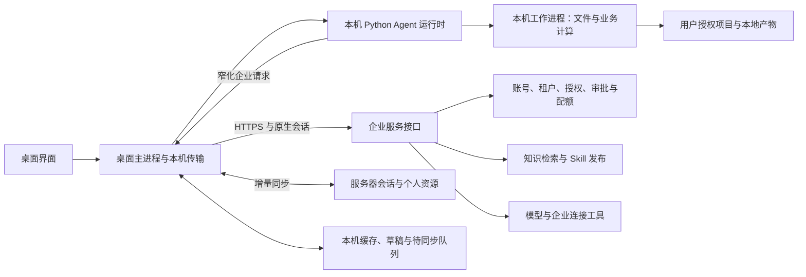

## Context

动机见 `proposal.md`。本次是文档提案，以下接入方式、接口和开关均为待实现设计，代码存在不代表端到端可用。

代码核对基线为 `origin/master@48c0d79c36146950667f8d1884ab823deae62305` 与 `rdai@416aebf3`，工作区另有进行中的 SAP 场景改动。详细观察见 `evidence/baseline.md`。

| 当前接入点 | 可复用内容 | 本 change 需要补齐的差异 |
| --- | --- | --- |
| `desktop/src/main/index.ts`、`python-manager.ts` | 本机 Python 后端、端口发现、重启、打包生命周期 | 当前 local/remote 二选一；增加本机运行时与远程企业身份共存 |
| `desktop/src/main/auth-broker.ts` | PKCE、主进程内存凭据、租户与 epoch、受限 IPC | 当前认证业务以单一 backendOrigin 为中心，需要显式区分两种地址 |
| `agent/protocol/agent.py`、`agent_stream.py` | 本机模型循环、工具装配、子任务、取消 | 企业配置与授权通过 provider 接缝接入，不能访问本机身份库冒充企业权威 |
| `agent/skills/manager.py`、`loader.py` | 本机目录加载、技能筛选 | 加入获权远程目录与精确资源 ID；新路径不能沿用缺身份/异常即无限制的旧分支 |
| `agent/knowledge/`、`agent/memory/`、知识 Web handler | 数据根、owner、已有检索和索引能力 | 为本地 Agent 暴露受控检索；现有列表/正文 API 不等于完整检索适配 |
| `desktop/src/main/project-execution/skill-transfer.ts` | 包传输、摘要校验、缓存 | 当前下载绑定服务器执行 command；本地编排需自己的授权用途，不能伪造 command |
| `agent/desktop_local/`、`desktop/src/main/local-execution/` | 工具 worker、资源落地、平台启动器 | worker 仅执行单个工具；不能把它当完整 Agent 循环，需区分固定处理与任意脚本 |
| `auth/capability_matrix.py`、`config.py` | 分片能力、声明和部署开关 | 项目执行/脚本仍未验收，固定本地处理未实现，不能直接承诺已可用 |
| `Scene/production_plan/backend/api.py`、财务分析 Skill | Excel 导入、业务计算 | 后端 API 内计算需抽取共用函数，桌面与 Web 选择不同执行位置 |
| `agent/memory/conversation_store.py`、`conversation_schema.py`、`agent/chat/session_service.py` | 既有业务会话和消息存储接缝 | 增量版本、同一会话跨端读取及单执行者；实施时核对所有写入口 |
| `channel/web/fork/handlers/sessions.py`、`knowledge.py`、`skills.py` | Web 业务入口与现有授权/并发合同 | 原写入进入统一变更记录，保留旧客户端合同，补个人定义维护 |

约束以现行 `openspec/specs/` 为准。特别保留 `fork-upstream-decoupling` 的已退役认证面、`desktop-tenant-context` 的主进程凭据边界、资源授权及隔离要求。参考 master 的运行结构，不切换代码分支、不恢复其已退役的旧认证。

## Goals / Non-Goals

**Goals:**

- 一个桌面会话只有一个本机 Agent 循环；企业服务提供资源和授权，不再代跑该会话的 Agent 循环。
- 同一服务器的获权 Agent 配置、知识、Skill、模型和企业工具可被本机运行时消费，使用资格与 Web 一致。
- 大文件解析、项目计算和报告生成优先在本机；选择服务器动作时清楚表达数据去向。
- 以 provider/transport 接缝复用现有运行时，保留上游同步、ToolResult、ExecutionRun、取消和存储接口。
- 会话、个人知识和个人 Skill 的已确认数据以服务器为唯一权威，桌面与 Web 可交叉读写；本机保存草稿/缓存并在连接恢复后自动补传，不静默覆盖其他端的修改。
- Web 独立于桌面运行与同步客户端，旧端点、历史操作、资源管理和默认服务器计算均保持兼容。
- 首批交付一条实际“服务器 Skill＋知识检索＋本地 Excel 计算＋本地产物”链路，并给出服务器资源占用与上传量的实测对比。

**Non-Goals:**

- 不建立另一套账号/角色数据库、企业 Agent 定义或共享资源管理后台；不挂载服务器文件系统为本机项目。
- 不实现整库离线镜像、多人实时协同编辑、同一会话多端同时执行、企业离线执行授权、全场景计算迁移、SAP 桌面自动化或远程服务器任意 shell。个人数据增量同步属于本期范围，不承诺任意冲突自动合并。
- 不随本 change 分发大模型权重或承诺完全离线推理；企业模型默认通过服务器代理，现有独立本地模式的模型配置保持。
- 不复制启动服务器 IM 渠道、共享 scheduler 或企业委派队列。服务器任务继续归服务器；本地子 Agent 可复用本机运行时但必须继承同一授权边界。

## Decisions

### D1. 新模式显式选择，完整 Agent 留在本机

新增 `enterprise-local`，产品名称“企业连接·本机运行”。现有 `local` 和 `remote` 配置值不改含义。用户选择新模式并连接企业后，本机 Python 服务可以先启动健康检查，但未建立有效企业上下文前不得进入企业聊天、资源或计算入口。

本机运行时继续使用现有 Agent/Bridge 和模型适配层，通过 fork 自有的企业 provider 装配配置、资源与授权。服务端只创建归属明确的执行登记和服务调用，不调用一次完整的 `/chat` 让它再规划任务。

取舍：继续远程 Web 加设备命令只能迁移工具，达不到本地编排目标；复制一套完整企业数据库到本机则引入授权和共享数据双写。本设计复用现有本机运行时并按资源远程访问。

### D2. 企业会话与本机进程通信分开

保存两个用途明确的地址：`runtime_origin` 只来自主进程实际启动并登记的 loopback 后端，`enterprise_origin` 只来自用户配置和校验的精确 HTTPS 来源。原生企业 AuthSession Bearer 仍只在主进程内存，绝不交给本机 Python、工具进程、renderer 或模型。

本机运行时使用主进程创建的专用子进程管道与受限消息协议提出企业请求；本机 UI 请求继续经受保护的主进程转发进入登记运行时。管道绑定启动代际与子进程，不能由任意本机网页或进程提交 user/tenant 声明来建立身份。需要本机传输秘密时仅用于当前进程通信，不作为企业账号或服务器认证令牌。

所有请求绑定 `{enterprise_instance_id, origin, user_id, tenant_id, device_id, agent_id, business_session_id, run_id, epoch}`；服务端实例 ID 在认证后确认，与 origin 一起隔离缓存，不能仅凭可伪造实例字符串复用凭据。身份字段由主进程会话及服务器确认，模型只提供业务参数。Agent ID 由用户选择且经服务器验证，不能从同名本地 Agent 推断。

取舍：不给本机后端一份可重用企业 Bearer，也不把受信的企业代理做成任意 URL HTTP relay。保留原本单来源 broker 的行为，通过明确目标分发扩展，不用频繁切换 backendOrigin 模拟双连接。

### D3. 使用一个企业服务接入面，逐步复验授权

拟新增版本化、仅原生企业会话可用的 `/api/desktop/runtime/v1/` 接入面，最终路径在实现时通过唯一 route registry 登记。以下是语义合同，不代表接口已经存在：

| 服务动作 | 返回/效果 | 权威边界 |
| --- | --- | --- |
| `capabilities`、`agents`、`agent-profile` | 协议、获权目录、去秘密的有效 Agent 配置和版本 | server 解析绑定/owner，不使用客户端权限数组 |
| `runs/start`、`steps/authorize`、`steps/consume`、`runs/events` | 复用 ExecutionRun 的登记、立即执行的一次动作资格、回执与取消 | server 重验身份、资源、审批、配额；HOST 绑定精确动作 |
| `knowledge/search`、`knowledge/read` | 有界检索结果、可复验来源 | 复用知识范围和 Agent 知识绑定 |
| `skills/catalog`、`skills/manifest`、`skills/package` | 获准运行技能及锁定包 | `skill.use` 与 Agent 选用资格；不冒充管理权限 |
| `model/invoke` | 单次模型响应/流与用量信息 | 复用 provider 共用派发点、服务器凭据和计量 |
| `tools/invoke` | 单个已登记企业工具的结果或状态 | 复用连接分配、动作授权、审批与凭据用途 |
| `personal-state` | 当前使用者企业记忆和允许跨端的非秘密配置 | 复用现有 owner 服务；写入统一版本与变更记录 |
| `sync/push`、`sync/pull`、`sync/snapshot` | 有界操作提交、增量变化及游标失效后的本人快照 | 按对象类型调用既有业务服务；不接受通用数据库/文件复制 |
| `sync/uploads/*` | 个人知识、个人 Skill 及显式附件的分块暂存、校验与提交 | 精确 owner、用途和大小配额；提交完整版本前不可见 |

目录、配置、运行分别声明能力；新端点复用业务授权服务，不直接调用 Web handler 绕过上下文。不返回服务器绝对路径、数据库连接串或公共秘密。

本机工具在本机排队，取得执行槽位后才请求动作资格，资格绑定完整身份、Agent、run/step、工具资源、参数摘要、项目 grant、Skill 摘要和 epoch。启动前在线原子消费并重新校验当前权限，不缓存跨步骤授权；响应丢失时查询原步骤状态，不新建 step 重放。`run_id`/管道句柄本身没有授权含义。

远程模型和企业工具在服务端消费资格并执行。本机动作由官方客户端在确认消费后立即派发，后续动作重新检查；客户端可被设备管理员修改，因此不把本机执行回执解释为可信远程证明，也不声称可以撤回已下载数据或已完成副作用。高价值秘密和需要服务端强制的操作留在服务器。

取舍：只同步权限快照无法保证撤权，逐次申请会增加少量网络往返。首期接受这项延迟，重计算仍留在本机；会话与必要状态按增量同步，大文件只按明确用途传输。

### D4. 企业模型代理只运行一次模型调用

本机完成上下文装配、工具选择循环与取消；企业模型代理只调用获权模型。公共模型密钥留在服务器，所有 provider 继续走统一分发、配额和计量接缝，复用流式事件/工具调用格式。

一个 `(run_id, step_id)` 对应一次模型消耗；HOST 转发和本机模型适配器不得重复记账。供应商未报告的 token 标为未知/估算，不能记零。响应中断后保留已发生消耗；有界恢复流或查询状态，不能在无确认时重新调用模型。

模型上下文会经企业代理传输，不承诺本地 Agent 等于数据不出机。项目工具提供摘要、异常记录和所需片段；用户选择发送附件时沿用原授权上传。企业模式不允许模型通过配置参数改为任意供应商 URL。后续独立立项可支持经企业策略批准的本地模型，本期不以其作为成功条件。

### D5. 共享知识远程检索，本地项目索引单独归属

企业知识继续由服务器维护文档、索引、版本与删除状态，检索复用既有算法和数据根判定。必须在候选查询与排序/计数前应用租户、owner、Agent 可见性、知识绑定及来源有效状态过滤，返回有界片段、文档/版本/片段标识、标题和来源引用，不返回原始存储根。

本地项目索引属于设备与目录 grant，标记为 `local-project`；企业结果标记为 `enterprise`。本地 Agent 可合并相关结果，但不能用本地同名文档替代企业来源，也不把本地索引上传成企业知识。共享库上传/写回沿用原管理资格、owner 和显式导入入口。

首次检索和每次引用回读都在线重验。首期不建立离线企业检索缓存；会话中已展示的引用是历史证据，不作为新读取资格。禁用/删除、撤权、模式切换后新请求按服务器现状处理。服务器故障返回可区分错误，不能伪装为零命中。

个人知识统一存储的目标是本人私有 Agent 的实际自有知识根，不能因 Agent 私有而写入其引用的共享库。用户在该知识库中新建/编辑，或明确将本地文件导入个人知识后，正文和原始资料按 D11 同步；服务器据已提交版本更新索引。本地项目目录不自动成为个人知识库。没有合法可写个人库时，沿用获权的创建/选择流程并说明条件，不偷偷改 Agent 模式或创建管理授权。

取舍：整库同步增加带宽、保密和失效复杂度；共享检索留在服务器更符合共享事实唯一归属。本地大量原始项目文件仍在本机预处理。

### D6. 共享 Skill 按获权用途分发完整包

新增运行目录 provider：按 `skill.use`、启用状态、租户开放和 Agent 有效选用集合返回最小目录。运行目录不代替 `/api/skills` 的管理列表；修改正文/启停仍走原 `skill.read/edit/enable` 及对象范围。

manifest 使用明确来源的 `resource_id`、版本摘要、入口、文件清单、平台/架构、依赖与执行方式。包包括 `SKILL.md`、其 references、scripts、templates 等实际资源，排除 `.env`、凭据、运行记录和客户样本。按身份授权获取包，校验所有文件及整体摘要，以暂存后原子发布方式缓存；拒绝路径穿越、软链接逃逸、大小超限和不完整依赖。相同名称不能跨来源借用授权。

缓存按企业来源/实例、tenant、user、resource_id、digest 分区；首期不跨账号共享可见缓存。运行锁定版本，更新后新运行可选新版本，旧版本只有仍获授权且未被禁用/撤销时才可完成原运行。已禁用或失去资格的 Skill 即使有缓存也不能装配到下一次模型上下文或启动下一步脚本。

按能力区分三类：指令与模板由本机 Agent 加载；可移植脚本/固定计算在本机运行；依赖企业凭据或内网服务的步骤用精确企业工具引用，秘密仅在服务端解析。不能把服务器绝对路径当成本机路径，也不把有网络需求的技能塞入当前禁止网络的沙箱后宣称兼容。

复用现有 package/manifest/cache 校验实现，新增本地 Agent 授权用途；已有 `execution/skill-package` 的 command 绑定合同保持。取舍：简单复制目录会丢失版本、来源和权限；按包分发需要依赖描述，但可以复用大部分本地技能加载器。

个人 Skill 定义新增明确 owner 作用域的完整包维护能力，仍在正式工具与技能页面展示。创建要求当前有效成员及 `skill.edit`，对象强制归本人；后续读取/维护继续要求 `skill.read/edit` 和对应资源授权，owner 范围在统一资源解析层处理，不自动赋予公共管理资格。个人参数不等于个人定义；两者分别保存。桌面可编辑工作副本并同步正文、引用、模板、脚本，服务器确认整包版本后供 Web 和其他桌面使用。可编辑副本与只读运行缓存分开；运行仍检查 `skill.use`、启用、Agent 绑定及平台能力，不把本地草稿装成已发布企业版本。

### D7. 计算运行在独立工作进程，按能力路由

企业模式采用统一计算分发接缝，工具调用和场景 API 都使用同一份业务计算函数。UI 与 Electron 主进程仅处理展示、授权及消息，不执行大型解析；固定任务由 Python 工作进程执行，有队列、取消、超时、内存/输入大小预算、进程回收和有界结果。

固定 CSV/XLSX 任务仅接受声明的操作与结构化参数，不接受任意代码、动态模块或 shell 文本；它的可用性不能开放任意脚本。任意脚本复用真实 OS 隔离，项目 grant 约束可写根，运行库与 Skill 缓存只读。Windows 固定计算可独立验证，任意脚本需要真实可用启动器；master 的 Windows cmd.exe 支持不作为企业隔离证明。

首批范围：CSV/XLSX 解析、类型/空值/行数等统计；财务分析 Skill 的本地数据处理与报告生成；排产导入 API 抽取后的本机解析。Web/服务器继续调用同一计算函数并保留输出合同。其他场景列入迁移目录，本期不承诺一并下沉。

路由由有效能力和已确认任务目标决定：项目计算为本机，企业连接工具为服务器。需要上传/服务器执行的任务先展示范围并按既有授权与适用审批执行；不能因本机失败自动 materialize 全文件到服务器。服务器传来的相对项目路径由本机 grant 解析，服务器路径永不覆盖本机 cwd。

### D8. 服务器统一存储，本机保留执行与草稿

| 数据 | 权威持有方 | 桌面保存的内容 |
| --- | --- | --- |
| 账号、Membership、角色、资源授权、企业 Agent 定义 | 服务器 | 当前会话投影、版本和临时配置，不产生本机可编辑真值 |
| 共享知识、Skill 定义与公共配置 | 服务器 | 有界引用及获权、可重建 Skill 缓存 |
| 会话消息、必要工具结果、标题/置顶/归档/设置 | 服务器同一业务会话的已确认版本 | 增量缓存、尚未确认的消息/操作；显示同步状态 |
| 个人知识正文/显式导入资料、个人 Skill 定义及完整资源包 | 服务器当前 tenant/owner 的实际资源 | 按需缓存、编辑草稿、待同步操作；不改变共享范围 |
| 企业个人记忆/允许跨端的非秘密配置 | 原服务器与既有 owner | 必要投影和版本化草稿；凭据仅保留受控引用 |
| 原始项目文件、完整大型产物、临时文件及本机索引 | 本机授权项目 | 文件及本机引用；明确选择为知识资料/附件时才上传 |
| 企业调用、审批、配额、服务器审计 | 服务器现有服务 | 关联 ID 与脱敏执行回执；避免重复记 token |
| 本机文件副作用 | 本机 | journal 为恢复依据；服务器只能标为客户端报告 |

扩展现有 conversation/session 存储组合接缝，保留业务 session ID、Agent/项目绑定与消息标识，按 origin/实例/tenant/owner 隔离；device 与运行位置是来源字段，不能使同一云端会话变成多份设备会话。首次实际提交消息后才创建持久会话；仅打开新对话或输入草稿不制造空历史。新企业本机会话默认增量同步可见消息、有界工具调用/结果及管理状态，不复制隐藏推理、秘密、进程环境或完整调试日志。已上传消息可能含用户输入和计算摘要，UI 明示“本机计算、会话同步”。

Web 和桌面在同一授权范围读取同一已保存会话。切换执行位置需已同步到确认检查点、消息与工具结果配对完整、原运行已结束或取消确认，并重新验证权限与附件可用性。复用 ExecutionRun 增加服务端单会话执行占用及代际，Web/桌面开始入口都检查；一个会话不能同时在服务器与桌面执行。占用过期并不证明本机副作用停止，未知运行先核对，不能自动抢占或重做。消息提交绑定该运行代际，旧执行者不得继续追加；迟到回执仅进入原 run 的待核对记录，不丢失且不接管新运行。用户明确复制为新会话时才创建新 ID 与来源关联。

Web 新建对话默认继续在服务器执行；打开已同步桌面会话可阅读已确认内容，空闲时可按上述合同续聊。仅在某设备存在的附件显示来源和不可用状态；需要用户选择授权上传、替代输入或回原设备继续，不能伪造远程可读路径。同步文本不会令所有本机文件自动可跨端使用。恢复会话仍重验当前 Agent/资源资格，不从历史恢复权限。

本机启动企业运行时不得复刻服务器 scheduler/IM 通道；本地子 Agent 继承同一调用者和逐次服务授权。当前桌面运行不新增跨设备调度；已存在的服务器任务仍在服务器执行。客户端退出或休眠后不宣称本机任务持续在线。

### D9. 失效、重连和恢复以身份代际与步骤状态为准

账号、租户、企业来源切换，退出或明确撤销时，HOST 先阻断新步骤，暂停旧身份同步，取消旧运行与可终止进程，关闭流，隔离旧缓存/视图，再允许新上下文进入。旧 epoch 的模型片段、包下载、知识结果、同步确认和计算回执不能落入新账号。未确认草稿和队列按原账号私有分区保留，重新登录同一身份并重验权限后才恢复，不为补传持久保存 Bearer，也不在退出时静默丢弃。

断网时企业新步骤暂停/失败并说明原因；已经合法开始的本地单步可以结束并写本地恢复状态，但后续企业步骤不得借缓存继续。首期不引入企业离线授权，恢复网络后必须重新验证。已下载内容无法远程收回，界面失效和清理不等于用户磁盘上的既有副本已消失。

断网期间可以保存原身份的本地编辑草稿和已经产生的结果到持久待同步队列；其状态是“待同步”，不是云端已保存，也不授权离线执行。运行状态和同步状态独立展示：计算完成仍可能待同步，已同步历史也不意味着任务仍在运行。重连先拉取当前版本、删除状态和权限，再提交可用的待同步操作；冲突保留双方可读版本，撤权暂停而非迁入公共空间。

本机副作用使用持久步骤 journal，至少区分未开始、执行中、成功、失败、取消和结果待确认。服务器登记与回执幂等；服务端按“已授权/客户端报告/服务端执行”区分可信来源。丢失回执不能重复写文件、提交企业业务或重复模型扣费；无法确认时保留未知终态并要求恢复确认，而非自动重做。

### D10. 分片启用与可测量的完成标准

拟新增新模式总开关及 knowledge、skills、compute、scripts、account-sync 的子能力声明，缺省关闭；最终名称统一登记在 capability matrix 和配置文档。新模式发布开放必须具备已验收的统一存储/同步，不能交付默认只存本地的企业会话。同步暂时不可用时明确排队，不误报已同步。子能力还需服务端声明、协议兼容、本机运行库及平台验证全部满足。新模式与同步开关不控制既有 Web/remote/Channel 入口；同步传输 worker 停止不应阻断 Web 正常业务读写。不得把现有项目执行切片简单改为 accepted 来代替新模式证据，也不得关闭已有合法功能当作测试通过。

阶段门槛：

1. G0：固定接口/数据归属和现有权限、审计、审批、配额切片证据；保留双侧行为基线。
2. G1：双地址登录、实际本机 Agent、企业模型代理、身份/租户切换和原模式回归；不以 mock 登录代替实机。
3. G2：真实共享知识及完整 Skill 分发；覆盖两个租户、两个成员、owner、版本和撤权。
4. G3：固定计算与两条代表性业务入口完成；任意脚本按平台独立满足隔离/凭据条件。
5. G4：统一存储/同步、Web 与两台桌面交叉读写、冲突/删除/崩溃补传、实际 macOS/Windows 安装包、迁移/回滚、断线/取消、用量和性能证据；缺少任一目标平台证据则保持该平台未验收。G1—G3 仅为内部阶段，不能绕过同步发布门槛。

相同合成数据集分别跑服务器路径与桌面路径，采集两端 CPU 时间、峰值内存、上传/下载字节、端到端耗时、模型 token、实际进程位置和输出一致性。网络字节分列模型、知识/包、同步消息及显式附件；测量同步积压和恢复时间，不能只统计计算通道。不预设未经测量的节省百分比；必须证明原始文件未因默认计算上传、计算进程在桌面、服务器未启动第二个 Agent 循环。

### D11. 增量同步采用服务端版本和持久操作队列

复用现有业务存储，不复制一套“云同步业务数据库”。同步记录只保存对象定位、提交版本、变更序号、删除标记和幂等结果。对象带稳定 ID、类型、owner/tenant、`revision`；操作携带稳定 `operation_id`、`base_revision`、来源 device 和内容摘要。身份由会话确认，客户端 owner 字段不能改变归属；客户端时间只用于展示，不能作为冲突裁决。凭据、角色、目录 grant、机器路径和执行授权不进入同步内容。

桌面业务编辑与 outbox 在同一本地持久提交中保存，失败不能先展示“已保存到服务器”。服务端按调用者/对象/operation_id 去重：相同 ID 相同内容返回原结果，相同 ID 不同内容拒绝。业务成功和变更记录必须可恢复地一致提交：数据库对象使用同一事务；文件类对象先暂存、校验并写持久提交意图，再原子替换并完成版本/事件，崩溃恢复后才确认成功。快照/拉取只暴露完整已提交版本。上传按 owner、用途、大小/文件数与存储配额预留，分块校验后提交；失败不替换旧版本，过期暂存可回收。

所有现有 Web/Channel/后台的同类业务写入口均经过上述存储接缝，包括自动标题、消息落盘、归档/删除、知识导入及 Skill 正文写回；不能仅给桌面 push 记变化。旧客户端不新增必填版本字段，服务端在原写事务内分配版本，保留 `expected_mtime` 冲突等既有响应。外部直接修改受管文件不能静默漏过：明确支持的文件刷新/导入入口统一登记版本；可检测的摘要变化先协调登记，再提供同步快照，不用双向扫描整目录替代业务服务。业务写入不等待桌面在线或同步 worker，轻量变更记录与存储自身一致性仍须保证。

拉取使用服务端有序游标和有界分页，在权限与 owner 过滤后返回当前范围的变化。客户端先持久应用页面再推进游标；重复页、乱序响应和进程崩溃不得丢失/重复对象。首次登录或游标过期采用带水位的分段快照，再接续水位后的增量，避免分页期间漏变更。快照替换已确认缓存但保留未提交草稿；同步通知只是加速提示，丢通知仍能经游标补齐。重试采用有界批次、退避和抖动，不反复全量扫描。

标量字段、知识文档和个人配置按 `base_revision` 条件提交；同一对象版本不符返回冲突及当前版本，保留原草稿供用户选择/合并，不按设备时间强行覆盖。会话消息以稳定消息/事件 ID 有序追加，流式片段使用消息修订和偏移幂等更新，完成后固定终态；合法中断保留 partial 状态，不伪造完成。大文本分块，未完整提交前显示待同步/部分内容；不通过静默截断破坏历史。工具大结果只同步预定有界表示及独立文件引用。同步仅保存已经发生的事实，不重新执行聊天发送、模型、工具或知识导入计算；派生索引单独按已提交版本幂等构建。

删除用递增版本的 tombstone 传播，已删除 ID 不允许旧草稿恢复；与更新冲突时返回删除状态，用户需要时只能显式另存为新的获权对象。会话删除继续先终止原目标运行，并阻断后续追加；归档仅修改归档字段。删除标记与去重记录有明确保留窗口，过期游标必须重新快照对账；旧操作的基准代际过期时拒绝并要求确认，不能因记录已回收就重放创建/副作用。恢复已删除 ID 不属于本期，合规保留/审计沿用原政策，不将同步 tombstone 宣传成所有备份物理抹除。

### D12. 个人资源、Web 兼容和发布边界

个人知识使用实际自有根与稳定文档 ID，重命名/移动是同一对象的版本变化；删除后旧索引不得命中，索引重建失败与正文已同步状态分别展示。个人 Skill 以完整包为版本单元，正文和资源一起提交；新建/更新/删除不影响同名公共 Skill，个人非秘密参数随本人状态同步，秘密保留服务器凭据引用。个人工作副本待同步/冲突时不可作为新企业运行的有效发布版本。同步不增加资源可见范围、不新建共享 grant。

Web 的现有历史、知识和技能页面接入同一已提交对象，新增可选来源/版本/同步状态字段，旧字段、路由和功能权限继续兼容。Web 自身成功写入就是服务器成功提交，不必等待任何桌面确认。同步协议暂关或桌面客户端退出时，Web 可独立登录、聊天、管理历史和维护获权资源；同步恢复后通过增量或快照追上。Web 新会话保持服务器执行；只对同一会话存在其他执行者、附件仅在本机或版本冲突等实际条件增加反馈，不要求所有 Web 用户安装桌面。

发布前用同一账号的 Web＋两台桌面，双向验证会话、个人知识、个人 Skill、非秘密配置及删除；再用其他成员/租户、非 owner 管理员做负向验收。兼容数据先升级、能力后启用；旧纯本地历史/目录只经用户选择导入，不扫描整盘、不复制 `~/.cow` 或身份库。服务器已有数据沿用原 ID/owner，后台补稳定版本与同步元数据，迁移可恢复且不重放历史运行。

## Risks / Trade-offs

- [逐步骤在线重验增加延迟] → 本机先处理成批数据，网络承载轻量授权与必要上下文；不以长寿命权限缓存换取速度。
- [本机 Agent 能读取获权知识和 Skill，设备管理员可复制] → 不承诺可撤回既有副本；只下发获权必要资源，公共秘密及强制企业业务操作留在服务器。
- [已有同名 Skill 与缺身份兼容分支] → 新 provider 使用完整来源 ID、受信上下文和拒绝失败策略，专门测试同名资源与接缝缺失，不改造为另一套权限库。
- [Windows 脚本隔离及打包依赖不齐] → 固定计算与脚本分开验收，打包依赖预检；旧模式的已支持命令功能保持，不能把未支持脚本自动转到服务器。
- [企业 Agent 配置和技能运行中变化] → 配置/包锁定版本，调用时核对实时资格；内容更新与权限撤销分别处理。
- [原始数据经模型上下文传出] → 展示模型服务位置、限制工具返回量、按需发送，不把“本地计算”宣传成“完全不出机”。
- [统一存储增加服务器磁盘与同步带宽] → 增量、有界、按需附件，分别计量同步流量/存储；不承诺服务器无负载，只把计算尽量放在桌面。
- [多端修改或过期设备复活已删除资料] → 服务端版本校验、删除标记、过期游标快照对账和旧代际拒绝；保留冲突草稿，不自动最后写入覆盖。
- [文件内容与同步元数据跨存储提交] → 暂存校验、持久意图与恢复流程，故障注入验证旧版或完整新版可见，不能确认半成品。
- [并行 change 修改相同接缝] → 按最终实现候选重核 route registry、隔离与凭据服务，不复制另一 change 的未验收状态，也不覆盖 SAP 工作区变更。

## Migration Plan

1. 实现阶段先固定当时 master/rdai 基线及现有开关，在独立测试数据下记录旧 local、remote、Web/Channel 行为；不更改当前用户的账号、项目或安装偏好。
2. 先发布服务端兼容接口及缺省关闭的能力，再发布可识别新模式的桌面候选；旧客户端继续使用旧端点，旧服务器对新模式返回明确升级要求。
3. 为服务器存量会话/个人资源补稳定版本、变更日志、去重及删除记录，保留原 session ID/owner/业务字段；为桌面增加版本化缓存、草稿和 outbox。迁移使用可恢复提交，不复制 identity.db，不将旧 `~/.cow` 内容自动标为某企业用户资产。
4. 用户明确选择新模式并完成企业登录/租户/Agent 选择后，按本人范围进行初次快照；新的会话和个人资源默认同步，旧纯本地数据只显式选择导入。已有服务器会话按 D8 的单执行者和附件检查合同续作；本机项目仍须目录授权。
5. 按 G1—G4 的已验收切片逐步开放；断网、低版本或未满足平台条件时显示具体原因，不迁回旧免鉴权模式。
6. 回滚时先停止相关新模式运行并核对未完成副作用，再关闭新模式能力或切回原模式。保留服务器已确认数据及本地草稿、outbox、产物和 journal；提示待同步数量和恢复办法。旧版本遇到未知模式应拒绝或引导使用兼容版本，不误读新分区。服务端使用向后兼容迁移，保留变更/删除事实及未结算记录，Web 继续可用，不直接删表/缓存销毁证据。

## Open Questions

- 固定计算的进程数、输入大小、超时、缓存容量等默认值，在代表性办公电脑与数据集基准后确定；必须有边界，不能默认为无限。
- 新模式首发安装包的 Windows 版本、macOS 最低版本与依赖分发组合在打包验证阶段锁定；协议按实际能力报告，未测平台不宣称支持。
- 服务器知识检索分页/top-k 与片段大小上限在现有索引性能测试中确定，不改变权限先过滤和来源可回读合同。
- 同步批次/分块大小、退避上限、磁盘预算、删除与去重保留窗口在容量及故障测试中锁定；无论取值如何，过期客户端必须快照对账且不得重放删除对象。
