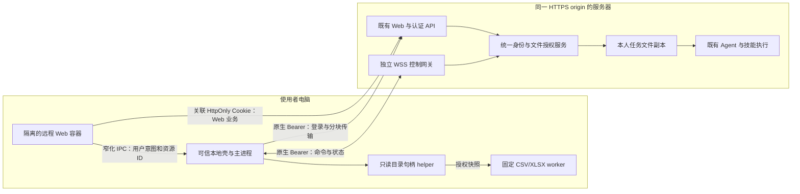

## Context

动机见 [proposal.md](proposal.md)。本设计基于 2026-09-28 工作树静态检查；未运行真实桌面客户端验收，不把源码中的注释、已存在页面或旧 change 完成状态当作本 change 通过的证据。

| 接入位置 | 已有行为 | 本 change 的实施方向 |
|---|---|---|
| `desktop/src/main/index.ts` 的 `createWindow/startBackend/setupIPC` | 加载本地 React，启动 Python，登记 loopback backend | 增加启动模式选择和远程容器装配；本地分支保持 |
| `desktop/src/renderer/src/App.tsx`、`hooks/useBackend.ts` | 基础业务路由、轮询本机健康接口 | 保留本地业务；远程模式只加载连接/设置壳 |
| `desktop/src/main/auth-broker.ts`、`auth/desktop_auth.py` | PKCE、内存 Bearer、主进程业务代理 | 增加明确远程 origin、原生签发来源、Web 子会话及受控引导 |
| `desktop/src/main/preload.ts`、`asset-proxy.ts` | 本地 renderer 原生桥及带鉴权资源代理 | 不把整个桥移交远程页面，新增独立 remote-preload |
| `channel/web/chat.html`、`core/template.py`、`static/js/console.js` | 当前实际发布的 Web shell、视图、功能注册 | 加载小型环境适配模块；不复制或打包另一份业务页面 |
| `channel/web/static/js/{identity-admin,audit-console,external-connections,todos}.js`、`scenes/` | 企业工作台与专业场景 | 原页面在容器验收，无 React 重写任务 |
| `channel/web/fork/handlers/{files,workspace}.py`、`fork/runtime.py` | 上传、本人工作区、预览、会话归属 | 原路径保留；新增客户端来源接口，禁止混淆绝对路径 |
| `common/state_dir.py`、`common/safe_fs.py` | 用户文件落点、受根约束文件操作 | 复用服务器用户根和文件校验；不宣称 Python 的跨平台降级可保护客户端所有竞态 |
| `agent/tools/tool_manager.py`、`agent/protocol/agent_stream.py`、`agent/approval_gate.py` | 工具发现、执行、授权与审批消费 | 增加受控客户端文件工具，复用逐次执行门禁 |
| `auth/capability_matrix.py`、`channel/web/route_registry.py` | 能力状态与单一 HTTP 路由/授权清单 | 所有新端点与开启状态登记；WSS 另有显式协议门禁及覆盖测试 |
| `desktop/src/main/{tray,updater}.ts`、`desktop/electron-builder*.js` | 后台、更新与签名基础 | 扩展远程上下文生命周期，配置真正的发行 feed |

`desktop-tenant-context` 的现行规范明确尚缺真实打包客户端切片验收。本 change 不能沿用“已有 broker”就认定该依赖通过。Web 资料转换、部分渠道执行、scheduler 通知等还受到各自能力与活跃 change 约束；承载测试只验证其当前正确开放/拒绝行为。

## Goals / Non-Goals

**Goals:**

- 同一个服务器发布的页面，在浏览器与桌面具有相同业务能力和逐请求授权。
- 建立可实施的原生会话到 Web 会话协议，令牌不进入页面，退出与切换不遗留设备访问。
- 首版桌面只读目录能力可以服务当前用户的交互式 Agent 任务，必要文件按需物化给原有服务器技能。
- 三个阶段分别可发布，任务与真实验收证据分离，所有功能默认关闭后逐切片开启。

**Non-Goals:**

- 不重写企业管理和场景页面，不删除原本地 React 模式，不自动上传/迁移已有本地数据库与项目。
- 不提供本地任意代码、Shell、浏览器自动化、全盘索引、自动写回、双向同步或无人值守唤醒。
- 不改变既有 Agent/Channel/ExecutionRun/scheduler 的身份语义；不因桌面文件功能而关闭或解锁其他已有执行能力。
- 不宣称只读目录授权等于 OS 沙箱，或本地解析等于数据完全不出电脑。
- V1 不承诺离线使用完整 Web 业务，不支持远程 origin 下的部署路径前缀；旧 Windows/Electron 发行线不开放未验收的远程模式。

## Decisions

阶段一交付本地壳、远程 Web 与关联认证；阶段二增加文件 helper、网关与按需副本；阶段三完善桌面生命周期和受限固定解析器。普通浏览器继续直接访问既有 Web。

### D1. 远程界面使用服务器 Web，可信本地壳保持小范围

使用现有 `BrowserWindow` 加载本地壳，并以 `WebContentsView` 装载所选服务器的 Web shell。壳只处理连接配置、原生授权、状态与窗口设置；业务菜单、权限、品牌、专业场景和账户页由 Web 提供。

远程视图使用独立内存 Session partition（不使用 `persist:`），`contextIsolation=true`、`nodeIntegration=false`、`sandbox=true`。每次账号/服务器变化销毁并新建视图分区；应用退出不持久化 Cookie。服务器地址与非敏感偏好可持久化，原生 token 不持久化。首版只允许一个活动服务器、一个账号、一个远程工作台；独立系统浏览器标签不受其租户切换影响。

替代方案是继续把 Web 页面逐个移植到 React；这会重复维护权限、状态和专业场景，本 change 不采用。仅将 `loadFile` 改成 `loadURL` 同时保留旧 preload 也不采用，因为那会向远程内容暴露过大的本机能力。

### D2. 登录使用原生父会话与独立 Web 子会话

采用现有系统浏览器 PKCE 登录作为唯一原生会话入口。增加服务端登记的原生签发来源及 `POST /auth/desktop/web-session`：

1. 主进程完成原生授权，持有父 AuthSession Bearer。
2. 主进程以该 Bearer、随机 `bootstrap_id`、运行实例 ID 申请 Web 子会话；端点拒绝 Cookie、普通 Web 会话换成的 Bearer及未登记来源的旧 token。
3. 同一事务重验父会话，撤销该父会话旧的远程 Web 子会话，创建独立 Web AuthSession、配对与审计。子会话不长于父会话。
4. 响应通过 `Set-Cookie` 交付新的 `cow_session`，JSON 仅含非秘密配对元数据。主进程专用代码验证响应 origin、Cookie 名称、host-only、Secure、HttpOnly、SameSite、Path 后安装到本次内存分区，再加载页面。原生 Bearer 不被写入 Cookie。
5. 同一 `bootstrap_id` 仅交付一次秘密；重放返回 `bootstrap_consumed`。若响应丢失，主进程用新 ID 重引导，事务撤销旧子会话。幂等状态查询只返回元数据。

此方案使用 Electron 主进程的 Cookie API，避免把一次性登录材料放进 URL 或将 native token 注入 JavaScript。引导响应不经通用 broker 返回 IPC；代理、日志与诊断排除 Set-Cookie。主进程读取 Cookie 仅限该安装路径；不导出用户系统浏览器 Cookie。

服务端解析关联 Web 会话时同时验证父会话仍有效，不依赖“撤销广播恰好送达”。Web 子会话退出和主进程退出都撤销同一配对的原生会话、子会话和文件绑定；不会撤销当初执行 PKCE 的系统浏览器独立会话。改密/账号停用沿用全局撤销。无法完成在线撤销时本地立即封锁操作，保留仅供撤销重试的内存凭据并提示未完成；用户强制退出时不宣称服务端已撤销。

这需要两个既有 Desktop requirement 的显式 delta，见 `specs/desktop-tenant-context/spec.md`。不更改普通 Web `/auth/login` 的空 token 响应和 AuthSession 不存当前租户的规则。

### D3. 页面上下文与本地服务通过服务端绑定衔接

Web 原有 `sessionStorage` 租户和 generation 继续使用。增加远程环境适配钩子：

- 开始切换/退出/重载前先调用 `suspendLocalContext()`；主进程自增本地 generation，封锁新文件请求。
- Web 完成当前 `/auth/me` 与租户解析后，向 `/api/desktop/bindings` 提交绑定申请；session/agent 等都是选择参数，服务端重验归属。零租户平台用户只建立账户/平台上下文，不创建文件绑定。
- 页面只把不透明 `binding_id` 交给主进程。主进程以 native Bearer 解析绑定，服务器验证其 Web 子会话与当前父会话关联；页面自报 user/tenant 不作为真值。
- 主进程核对发起时 generation 与当前视图，再激活连接；旧解析响应作废。一个活动 Web 作用域可有多个本人业务 session 绑定，切换租户则全部失效；切换聊天无需撤销其他同租户正在执行的任务。
- 本地目录授权按 `server_id/user_id/tenant_id/device_id/workspace_id` 隔离，关联到明确业务 session 后方可供 Agent 使用。回到旧租户可显示历史目录但需用户再次连接；不自动复活旧授权版本。

绑定是文件用途记录，不是全局服务器当前租户，也不是将设备改造成合法机器主体。定时任务仅消费已物化输入；自动后台设备访问另行设计。

### D4. 原生桥按文档身份和动作限制，预览不继承

新增 `desktop/src/main/remote-preload.ts`，仅暴露 `desktopHost.v1` 的环境能力、状态订阅、目录连接意图、另存为意图、通知/窗口操作。目录操作返回资源标识和展示名，不向页面给原生文件句柄或任意 `readFile(path)`。

主进程验证特定 WebContents、主 frame、配置 origin、登记 shell 文档、当前导航序号与协议。只放行服务端路由清单导出的 shell 文档入口；任意同源 URL 不是可信 shell。用户生成 HTML/文档预览进入不带 remote-preload 的独立 sandbox 视图，iframe 继续执行既有 sandbox；禁止预览脚本借同源父窗口访问桥。

网页可用桥制造“用户意图”提示，但真实目录选择、授权范围与覆盖确认由可信本地 UI 完成。bridge 不暴露通用 HTTP、Cookie、Bearer、任意 URL、任意文件读取或进程启动。外链仅允许经过校验的 http/https 用户链接，`javascript:`/`file:`/任意自定义协议不交给 shell；确需邮件/协议后续按明确动作扩展。

Web 适配新模块位于 `channel/web/static/js/fork/desktop-host.js`，通过现有装配接缝加载。不得在 `console.js` 散落分支，也不提前完成其他 change 的单体退役；同时覆盖实际生效的 classic/split 模式。

### D5. 文件控制通道采用独立 aiohttp WSS 网关

现有 web.py/WSGI 服务继续负责业务 HTTP、认证、数据库事务和上传。已有 `aiohttp` 依赖可承载新的 `integrations/desktop/gateway.py`，以独立受监督进程运行，仅监听内部地址。反向代理在相同 HTTPS origin 下将 `/api/desktop/connect` 的 Upgrade 转到网关；客户端使用主进程 `ws` 库并在握手头提供 native Bearer，URL 不带 token。

这样无需将现有聊天 SSE、WSGI 路由整体改成异步，也不会让大量持久设备连接耗尽 Web 请求线程。WSS 仅传不超过 64 KiB 的命令、确认、取消、状态与心跳；文件字节走可恢复 HTTPS 分块接口。所有网关命令与 HTTP handler 共用 `integrations/desktop/access.py` 权限服务，不能复制一套简化鉴权。

V1 为同一服务器主机上的多进程部署，共享本机身份库及受控数据目录，不支持在网络文件系统共享 SQLite 实现多主机 HA。网关连接和命令通过数据库租约、连接代次及持久 outbox 协调；数据库事务不覆盖网络等待。身份/租约/审计不可读时拒绝命令。网关重启失去旧连接，不因此重跑业务任务。

### D6. 本地文件访问使用受根锚定的文件服务

主进程不在 UI 线程递归扫描。新增 `desktop/src/main/local-files/` 服务及 `desktop/native/fs-guard/` 的小型 Rust 文件 helper，打包预编译签名二进制并通过私有 stdio 协议调用，客户端不在线下载编译器。

helper 保留用户选择的根目录句柄；macOS 使用逐组件相对打开与 no-follow，Windows 使用相对父句柄打开/检查 reparse point 的实现，不以 `realpath + open` 充当竞态保护。实现前先完成两个平台的逃逸与替换探针；未通过的平台只提供普通选择上传，`local_files` 不开放。

V1 拒绝符号链接、junction/reparse point、网络盘、设备文件及 `nlink>1` 文件。遍历分页且不跨入被拒项，返回跳过数量；隐含目录默认不扫描，用户可以显式选取受支持普通目录，但预设敏感路径排除不能由模型参数关闭。根身份变化时要求重新选择。用户主动复制内容进已授权根无法被这个边界识别，不声称具有来源追踪或 OS 全盘沙箱。

授权持久记录只作候选：绝对路径在 OS 用户可读的本地配置中，权限设置为仅当前用户可读；不含 token，不同步服务器，不进遥测。活动 grant 在内存中，带递增版本；注销和完全退出清空。

### D7. 客户端文件先登记，再按需物化给既有工具

新增 `client_files` 工具，操作为 `list/stat/search/read_text/materialize`，每次通过原有 `tool.execute`、资源 grant、Agent/use 与 owner 检查；工具描述仅在相关绑定可用时出现，服务端执行时仍重验。Web 本地面板复用同一操作服务与文件权限，不绕过工具资源授权。

返回结构化引用 `{source:"client", device_id, workspace_id, relative_path, version}`；`client://...` 仅为展示序列化。客户端文本读取返回有界数据及来源，文件内容按不可信工具数据进入模型上下文。PDF/Office 默认先 materialize，不假定现有 `read` 能理解远程 URI。

发布副本使用 `common.state_dir.agent_user_work_dir()` 下的 `desktop-inputs/<run_id>/<transfer_id>/<safe_name>`；新的内部暂存区不在普通 browse/preview 根中。写入路径只由服务器构造，并纳入既有用户目录归属和预览鉴权。副本不是跨用户按 hash 共享的全局缓存。

运行从工具调用等待文件时记录 `pending_device/reading/transferring/ready`，与已有 run/tool event 相联，不能另建同名第二 ExecutionRun。单次等待超时返回明确错误供用户重试，不长期占用 Agent 线程等待未知在线时间。取消只取消该步骤及未发布传输，不宣称回滚已提交业务动作。

### D8. 传输使用预留、暂存、校验、发布账本

`contracts.md` 定义 HTTP 状态机与默认限额。关键步骤为：

1. 创建传输时原子预留存储与并发额度，绑定 actor/tenant/Agent/session/run/request/source version。
2. 顺序分块写入临时文件；重复块只允许同摘要，断线按已确认 offset 恢复。
3. 客户端读取前后比较身份、size、mtime；服务器计算完整摘要，客户端提交预期摘要。不能获得稳定视图时报告变化，最高自动重试一次。
4. 以发布 intent 记录将传输置为 `publishing`，同文件系统原子改名，再事务完成目录记录、额度结算及审计。
5. 通用文件接口只识别 `committed` 记录；若进程在改名后事务前崩溃，reconciler 验证哈希与目标归属后完成或移回隔离区。审计失败不能让文件被普通接口发现。

客户端主动作“另存为”走既有获权产物读取，原生对话框选目标，临时文件校验后替换；已有目标需明确确认，不给 Agent 开放自动写入。适用审批不是由按钮确认替代：普通用户下载登记为不适用；未来自动写回需审批规则与证据，本 change 不实现。

### D9. 数据模型与唯一归属

新增表放入现有身份库迁移体系（版本号由实施时最新版本分配），启用 foreign_keys，时间使用 UTC，所有秘密仅保存 hash；不把令牌写入这些表。仅传输临时字节落文件系统。

| 表/记录 | 核心字段与约束 |
|---|---|
| `desktop_native_origins` | `auth_session_id PK/FK, client_id, created_at`；只在 PKCE 成功事务写入，不能从旧 User-Agent 回填 |
| `desktop_web_links` | `id, native_session_id FK, web_session_id UNIQUE FK, bootstrap_id, instance_id, created_at, revoked_at`；`UNIQUE(native_session_id,bootstrap_id)`，每个 native 同时至多一个活动子会话 |
| `desktop_devices` | `id, user_id FK, installation_id, display_name, platform, created_at, disabled_at`；唯一 `(user_id,installation_id)`；安装 ID 不作认证 |
| `desktop_bindings` | `id, link_id FK, device_id FK, tenant_id FK, user_id FK, agent_id, business_session_id, context_nonce, expires_at, revoked_at`；所有 owner 从权威会话解析，业务 session 用现有复合归属定位 |
| `desktop_workspaces` | `id, device_id FK, tenant_id FK, user_id FK, label, grant_version, status`；不存客户端绝对路径；grant 需当前 native 连接重新激活 |
| `desktop_binding_workspaces` | `(binding_id,workspace_id) PK, grant_version`；连接工作区必须是同用户同租户同设备 |
| `desktop_connections` | `device_id, native_session_id, connection_epoch, gateway_id, lease_until`；租约 CAS 保证一个活动设备连接，旧连接不能确认新命令 |
| `desktop_commands` | `request_id PK, binding_id, workspace_id, grant_version, connection_epoch, op, params_digest, state, deadline, result_ref, created_at`；结果内联有界，文件引用不可跨作用域 |
| `desktop_transfers` | `id, request_id, tenant_id, user_id, agent_id, business_session_id, run_id, source_ref, source_version, total_bytes, received_bytes, sha256, state, reservation_id, storage_rel, expires_at` |
| `desktop_transfer_chunks` | `(transfer_id,offset) PK, length, sha256`；同 offset 异内容冲突 |
| `desktop_storage_reservations` | `id, tenant_id FK, user_id FK, transfer_id UNIQUE, reserved_bytes, state`；与现有 quota 限额/使用量同事务适配，不建第二套配额真值 |
| 本地配置 | `mode, server_profiles, active_profile, directory_candidates, preferences`；不包含业务会话正文或登录秘密；版本化迁移 |

命令控制记录默认保留 7 天并删除正文；审计按既有审计保留策略。暂存默认 24 小时，发布输入从任务结束起保留 7 天；运行中引用阻止回收。产物沿用既有 outputs 策略。用户撤销目录权限与删除服务器副本为两个动作，界面分别说明。

### D10. 阶段三本地解析范围固定

实现两个固定处理器：`csv.inspect.v1` 返回编码、列名、行数、有限样本；`xlsx.inspect.v1` 返回工作表、维度、有限样本及数据类型。处理器代码随签名包固定交付，不接收代码、表达式或依赖 URL。

使用已有 Python 打包链路构建独立解析 worker，CSV 用标准库、XLSX 用构建时锁定版本的 openpyxl；不启动完整 Agent。输入由文件 helper 生成授权快照，worker 只收到快照路径及有界参数，禁用宏执行/外部链接，不计算公式，缓存值与公式文本明确区分。解析前校验 ZIP 展开预算，解析中继续累计实际资源用量。

操作系统的子进程资源限制和网络限制需要各平台实现并真实验证（Windows Job/受限令牌与网络策略、macOS 对应受限 helper 策略）；单纯 fork/utility process 不等于安全沙箱。缺少限制机制时能力保持关闭，不能以任意 Python 子进程替代。此子阶段为“实现包含、部署可选”：没有真实证据不勾选任务；可以先发布阶段三其他已验收能力。

### D11. 生命周期、通知与升级

状态机：`unconfigured -> probing -> authorizing -> bootstrapping -> ready`；运行中可进入 `reconnecting/auth_required/incompatible/blocked`。窗口隐藏不等于退出，完全退出关闭网关、helper、worker与内存分区。休眠后检查权限及源版本，采用带随机抖动的指数重连，不重发未知结果的业务写入。

通知复用现有 scheduler/run 标识去重，默认只显示任务完成/失败摘要；点击携带内部资源标识，主进程核对服务器与账号后交给 Web 定位。运行任务期间更新先提示处理未保存内容与传输，默认不强制自动安装。

业务页面版本随服务器，bridge/control/transfer 使用独立 major/minor 协商。发布 feed 来自受控客户端配置，不接受网页修改，不把品牌官网地址当作 feed。首发配置真实 feed、签名证书/公证、平台构建校验和最低支持协议；远程模式支持平台不足时只开放已验收的平台。

### D12. 分阶段开关、依赖和交付门槛

配置键统一由 `config.py` 声明，映射到能力注册表；以下是新增键，不是当前已存在配置。缺省均 `false`。

| 阶段 | 开关 | 必须先提供的证据 | 开放范围 |
|---|---|---|---|
| 一 | `desktop_remote_web_enabled` | PKCE/Web 引导与撤销、原生桥隔离、真实双租户客户端、全部 Web 基线行 | 同源 Web 承载；不开放持续目录访问 |
| 二 | `desktop_local_files_enabled` | 阶段一；路径 helper、设备逐次授权、真实网关、存储配额原子竞争、文件发布审计、断线/撤权测试 | 只读文件操作及用户另存为 |
| 三 A | `desktop_native_notifications_enabled` | 阶段一；当前通知源实际可用、跨身份点击、真实 OS 权限测试 | 系统通知；其余后台/更新为客户端偏好和发布配置 |
| 三 B | `desktop_local_processing_enabled` | 阶段二；处理器授权、版本、资源/网络限制与两平台真实文件结果 | 固定 CSV/XLSX；不开放任意代码 |

开关是部署收紧，不是权限真值；`implemented/accepted/available/reason` 同时由能力矩阵投影，依赖缺失即不可用。既有 Web/Channel 不因这些开关关闭而失效。`audit-log`、凭据保密、硬配额、审批适用性、已有执行隔离必须按实际动作切片提供证据；不要求无关 capability 全量重验，也不伪造通过。

## Risks / Trade-offs

- [远程页面更新改变原生调用] → 窄桥、版本协商、未知动作拒绝、同源也做文档实例检查；容器上线前实际恶意预览验证。
- [两种会话关联撤销遗漏] → 父子解析逐请求重验，事务化退出、普通浏览器不受配对退出影响，双向路径列入 P1 门槛。
- [Windows 路径竞态复杂] → 预编译句柄 helper 及平台探针；不可实现的平台关闭本地文件，不降低路径标准后宣称等价。
- [SQLite 单主机吞吐/网关背压] → 异步网关、短事务、租约与有界队列；验收 100 在线设备及 Web 并发。多主机 HA 需后续存储适配。
- [上传期间文件变化] → 持有句柄、版本前后核验与校验和；没有外部写锁时明确保证是可验证读出版本而非全盘事务快照。
- [用户误以为原文件永不离开电脑] → 授权明确“按需传输”，本地解析显示会返回的数据范围，不静默回退全文件上传。
- [本地包体积与更新成本] → 固定 worker 单独构建，默认关闭本地解析；本地/远程两种模式首版保留同一包，后续再评估轻量发行版。

## Migration Plan

1. 记录提交基线、现有能力开关、数据库 schema 版本与 Web 功能矩阵；备份身份库和客户端配置，禁止复制真实秘密到测试证据。
2. 以增量迁移建立关联会话和桌面表/索引；旧 AuthSession 不推断 native 来源，旧用户数据不搬迁。迁移可重入、失败回滚，未知 schema 客户端拒绝写入。
3. 先部署关闭全部新开关的服务器及同 origin 反向代理路径，再发布客户端内测包。本地模式行为和已有 Web 路由回归通过后运行阶段一验收。
4. 逐平台开放阶段一，再部署内部网关和 helper 开放阶段二，最后按子切片开放阶段三。不得先开文件/解析开关再补前置证据。
5. 回退先关闭处理器/文件能力、封锁新任务、取消未提交传输并排空网关，再关闭远程承载；撤销该模式所有父子配对和绑定，清理客户端分区。已发布任务输入按策略保留，不删除用户源文件或本地模式数据。
6. 应用回退保留新增表；回退到不认识父子会话的旧服务端前，必须先显式撤销所有关联父/子会话，避免旧解析器忽略父会话约束。数据库备份恢复同样批量撤销桌面会话/租约，不恢复活动授权；不能简单复制旧 DB 后恢复连接。
7. 保存 `evidence/phase-1.md`、`phase-2.md`、`phase-3.md`、`migration-recovery.md`；本次设计阶段不创建假验收记录。

## Open Questions

仅以下部署参数可在实施时决定，不改变规格：公司正式 HTTPS 域名与企业 CA、生产签名/公证身份、更新 feed 地址、实际容量限额。默认限额见 `contracts.md`；参数缺失时相应生产发布不得通过，但不阻止实现与本地测试。架构、认证方式、文件访问边界、阶段范围及支持平台不留作程序员自行选择。

## References

- [Electron WebContentsView](https://www.electronjs.org/docs/latest/api/web-contents-view)：用于承载独立 Web 内容。
- [Electron Cookies](https://www.electronjs.org/docs/latest/api/cookies)：主进程可管理特定 Session 的 Cookie；本设计限制在专用内存分区。
- [Electron Security](https://www.electronjs.org/docs/latest/tutorial/security)：远程内容隔离、限制原生桥与 IPC sender 验证。

以上外部文档核对于 2026-09-28；实施应针对仓库最终锁定的 Electron 版本验证，不能只据 latest 文档声明当前发行包已支持。
