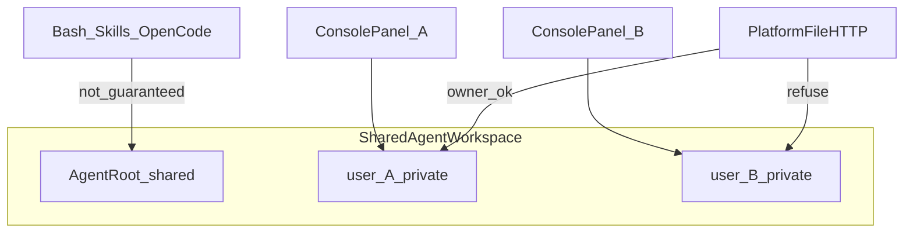

# Shared-agent per-user default directory — analysis evidence

Recorded from the analysis plan (2026-09-29). **No product code change** in this slice.

## Layer clarification (decision)

| Layer | Status for this analysis | Notes |
| --- | --- | --- |
| Server panel / platform file landing (`user/<immutable_user_id>/`) | **In scope as the current product model** | Already specified and shipped (`agent-user-file-directories`; console `wsAgentLandingPath`) |
| Agent tool cwd / bash / skills / OpenCode disk access | **Out of scope for change** | Spec explicitly does **not** promise per-user isolation here; cwd must not be switched for the user |
| Desktop local folder / project-chip default | **Out of scope for change** | Separate product definition; grants are server/user/tenant/device, not agent_id |

**Confirmed default for any follow-up:** treat questions about “共享智能体默认每人自己目录” as referring to the **existing server `user/<id>` landing**, unless a later change explicitly names Agent cwd or desktop local grants.

## Verdict (residual risk, not a missing feature)

Server-side already defaults shared Agents to each caller’s own subtree for platform uploads/delivery and the console file panel. That fixes the **platform file surface** (no cross-user overwrite, no admin bypass of `user/<id>`). It does **not** equal per-user isolation for Agent execution.

## Why the default is correct

- Without per-user dirs, same-name uploads/results overwrite and preview links cross users.
- Placement must use authenticated user id only; admins must not read others’ private subtrees.
- Landing on own subtree avoids leaking other members’ folder names.

Authoritative specs:

- `openspec/specs/agent-user-file-directories/spec.md`
- `openspec/specs/tenant-resource-isolation/spec.md` (shared Agent still has private `user/<id>`)
- Console landing: `channel/web/static/js/workspace.js` (`wsOwnUserDirPath` / `wsAgentLandingPath`)
- Path shape: `common/state_dir.py` (`agent_user_root` → `<workspace>/user/<user_id>/`)

## Main problems under the current server model

### Execution isolation is not promised (largest risk)

`agent-user-file-directories` covers platform file UI/HTTP only. Python/Shell/skills/OpenCode direct disk access are **not** user-isolated by that rule; process cwd must not be switched for the user. Panel default `user/A` does not lock tools to `user/A`.

`execution-isolation` also states: default project selection must not be treated as an access boundary.

### Shared mental model vs private landing

- Agent root / shared knowledge: shared semantics
- Uploads, delivery, private outputs: only own `user/<id>`

Effects: shared materials are less discoverable; team outputs do not converge; support/audit evidence fragments per user; admins cannot browse private subtrees (by design).

### Session and project paths

If a session/project chip stores a path under `user/A`, identity switch must refuse by owner. Sharing that absolute path as a “team resource” creates false expectations.

### Lifecycle and naming

Disabled/left users leave orphan dirs; unknown-owner legacy migration is hard. Do not confuse Agent-local `user/<id>/` with shared-root `users/<id>/` (`common/state_dir.py`).

## Extra problems if “default” meant desktop local folders

- Local paths cannot be shared across users.
- Grants are not keyed by `agent_id`; switching shared Agent does not auto-switch local root.
- Full workspace registration is native-biased.
- Schedulers/offline jobs cannot assume another user’s device/grant is live.

## Not problems

- Admins cannot read member private subdirs: required by spec.
- Same filenames in different user dirs: intentional anti-overwrite.
- Browser lacks “choose local folder”: local grants are desktop-container only.

## Decision implications (no implementation this turn)

- Platform file anti-leak / anti-overwrite → **keep** per-user server default (already shipped).
- Team co-editing one tree → needs explicit shared area or publish flow (separate change).
- Claim execution is per-user isolated → **false today**; needs a separate execution-isolation change.
- Desktop local default follows shared Agent → separate product definition; do not conflate with server `user/<id>`.

## Implementation gate

No code, config, or capability switch was changed for this analysis. A future change may proceed only after naming one of the three layers above and opening a dedicated OpenSpec delta for that layer.
