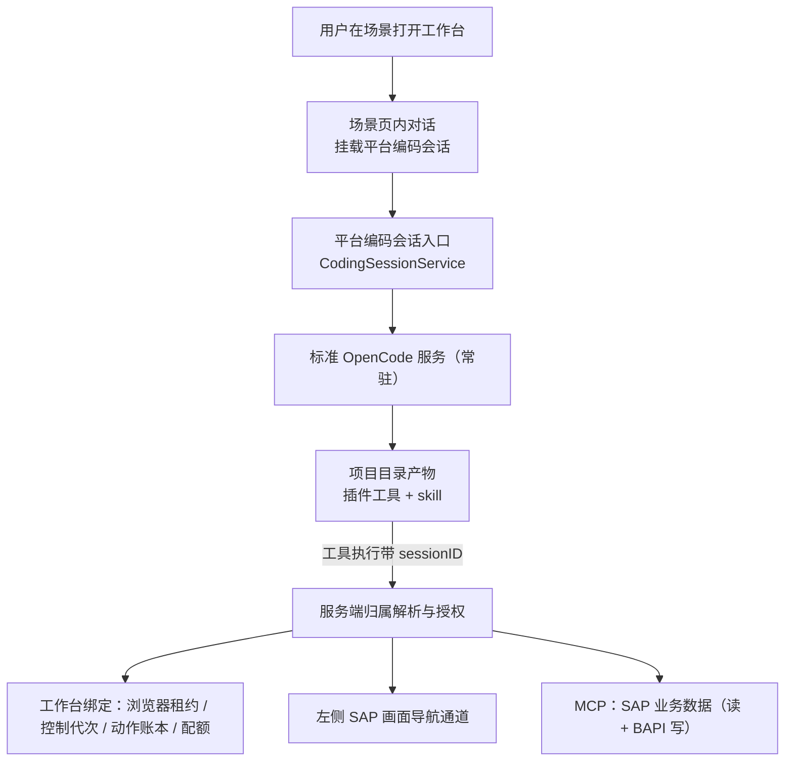

# 设计说明

## 背景

工作台当前自建并自管 OpenCode 引擎（每绑定一个 `bun.exe`、一个专属端口、一个专属对话库），并在创建请求内等待引擎就绪。启动超预算即 `opencode_start_timeout`，新建会话先关闭同账号其他绑定，空闲关引擎，硬杀后无对账。用户结论：不按租户也不按账号划分引擎，而是**复用平台既有的编码智能体入口**，并把 SAP 能力抽象为项目目录内的产物。

## 可复用的既有机制（代码核实）

| 机制 | 位置 | 核实要点 |
|---|---|---|
| 编码会话 HTTP 入口 | `channel/web/fork/handlers/coding.py` | 四个端点：创建/续建、打开、attach、同步；身份取自 `RequestContext`，客户端不得声明 owner |
| 平台会话 ↔ OpenCode 关联 | `agent/coding/sessions.py` | `reserve` / `open` / `attach` / `sync`；会话 id 由 `(service_id, tenant_id, user_id, agent_id, request_id)` 派生，上游对已存在 id 采用而非新建 |
| 服务地址与鉴权 | `agent/coding/__init__.py` | `CodingSettings`：`service_id` / `api_url` / `web_url` / `auth_headers()`；`coding_web_only` 约束 coding 只能走 Web 编码入口 |
| iframe 挂载与通知 | `channel/web/static/js/coding.js` | `POST /api/coding/sessions` → `open` → 挂载 `iframe_url`；`attach` 注册用户在 OpenCode 内新建的会话 |
| 项目目录 skill 发现 | `rsmCode/opencode/packages/opencode/src/skill/index.ts` | 原生扫描 `{skill,skills}/**/SKILL.md`（含项目配置目录）与配置项 `skills.paths` / `skills.urls` |
| 插件自定义工具 | `rsmCode/opencode/packages/plugin/src/index.ts`、`tool.ts` | `Hooks.tool` 可按名注册 `ToolDefinition`；`ToolContext` 带 `sessionID` / `messageID` / `agent` / `directory` / `worktree` / `ask()` |
| 项目插件部署先例 | `Scene/sap_workbench/opencode_adapter/native-host.ts` | 把 `navigation-guidance.js` 写入 `<project>/.opencode/plugins/` |
| 场景 skill 先例 | `Scene/sap_data_analysis/skills/sap-integration/` | `SKILL.md` + `references/` + `scripts/` 的可用结构 |

结论：会话创建、挂载、历史同步、skill 发现、工具注册全部已有，工作台侧只需交付项目产物与一条导航通道。

## 关键认知：skill 是知识，工具是能力

`tool/skill.ts` 把 `SKILL.md` 正文注入模型上下文，skill 自身不具备执行能力。因此能力必须这样分配：

| 需要的能力 | 承载物 |
|---|---|
| 流程、事务码、风控纪律、禁用动作 | skill（`SKILL.md` + `references/`） |
| 读取 SAP 业务数据 | MCP（已登记 `sap-abap` / `sap-pyrfc`，或新增本地 MCP server） |
| 推动左侧 SAP 画面打开事务 | 项目插件工具，回调服务端导航通道 |
| 读写左侧页面字段 / 提交 | 无可行路径（跨域 iframe） |

## 目标架构

## 会话流程

1. 场景读取自身配置（`coding_agent_id` 与项目目录来自该智能体的 `coding_project_dir`），经平台编码入口创建或打开会话。
2. 每次"新对话"对应一个 `request_id`，因此对应一个 OpenCode 会话；历史由平台列表同步，用户在 OpenCode 内新建的会话经 `attach` 归入历史。
3. 页内对话直接挂载编码入口返回的 `iframe_url`；打开动作不发送提示词、不调用模型。

本变更**取代**此前确认的「一账号一项目目录一个会话、存在则打开最新」口径：该归并会与平台会话列表语义冲突，且失去多会话并行能力。

## 服务端归属解析（安全边界）

插件工具只能拿到 `sessionID` 与项目目录，因此每次工具执行 SHALL：

1. 由服务端按 `sessionID` 反查该会话归属的平台用户与工作台绑定；
2. 复用既有校验：主体授权、浏览器连接、控制代次、动作账本、配额；
3. 未归属或未授权的会话返回**未绑定拒绝**，MUST NOT 借用其他绑定的浏览器目标。

MUST NOT 采信模型参数、请求体或提示词中声明的用户、SAP 账号、浏览器或 `session_id` 之外的标识。

## 可见性收窄

项目目录内的插件与 skill 对该项目的**所有**会话可见（包括普通编码对话）。SHALL 通过 OpenCode 权限规则把 SAP 工具收窄到场景发起的会话；即便工具可见，服务端仍逐次校验归属，权限规则只是减少误调用而非授权依据。

## 业务数据通道（凭据中介）

业务数据读取与 BAPI 调用 SHALL 走场景中介通道，MUST NOT 把 MCP 凭据或 `connection_id` 交给模型或插件：

1. 插件只暴露业务参数（`tool` 与 `arguments`），连接标识由插件常量给出、由服务端独立校验；
2. 服务端按会话标识解析绑定，解密该绑定的凭据，在 MCP worker 内部附加 `connection_id`（`SapMcpLogin._call`），口令与连接 id 不越过该层；
3. 参数在**写入 worker 之前**校验：`run_query` 必须是单条只读 `SELECT`，`read_table` 有表名/字段/行数上界，`call_rfc` 有函数名与参数体积上界；`connection_id`/`user`/`password`/`client`/`host`/`url` 等身份键一律拒绝——与导航通道同一条所有权规则；
4. 通道工具面**不含**系统变更类 ADT 工具（改源码、激活、传输创建/放行）：本通道的目标是业务数据，不是改 SAP 系统本身。

本组最初按「只读」设计（任务 3.5 的原始前提），后按用户决定改为**读写皆可**并放开 BAPI 提交，理由如下，如实记录该前提已被逆转：

- 只读并不能带来安全边界：真正决定能做什么的是 SAP 账号自身的授权，而不是通道的动词表；把动词收窄只让「能读不能写」的账号也一样写不了，却让「该写」的场景拿不到该有的能力。
- 因此边界改为**可审计 + 参数受限 + 凭据不落地到模型**，而不是禁用写操作。

代价（如实记录，不做过度保证）：`call_rfc` 可调用会改变业务数据的 BAPI。这类调用与查询动作在语义上**不同**——传输失败或被拒时，SAP 可能已经写入，因此失败状态记为 `unknown`（不是 `failed`），界面与 skill 均要求人工核对，MUST NOT 记为「未执行」。同理，传输成功也只是传输成功，MUST NOT 表述为「已创建 / 已过账 / 已审批」。

## 能力边界（如实标注）

| 能力 | 状态 | 依据 |
|---|---|---|
| 左侧画面打开事务码 | 有限可用 | 需保留一条服务端导航通道；只确认导航送达，不代表登录或业务结果 |
| 读取 SAP 业务数据 | 可用（凭据就绪时） | 场景中介通道 `sap_data_call` 的 `read_table` / `run_query` |
| 经 BAPI 变更 SAP 业务数据 | 可用（凭据就绪时） | 同一通道的 `call_rfc`；可能改变业务数据，传输成功不等于业务完成 |
| 读左侧页面 DOM / 填写 / 提交 | 不可用 | 跨域 iframe，插件与 MCP 均读不到；归档记录导航实测未通过 |

界面与文档 SHALL 按上表标注，MUST NOT 以 skill 已就位宣称页面读写可用。

落实位置：界面能力说明由 `backend/configuration.py:capabilities()` 的 `notes`（`navigation_limited` / `mcp_business_available` / `mcp_credentials_missing` / `page_readwrite_unavailable`）下发，`frontend/workbench.js` 在三语消息中渲染为能力列表，与 `blockers` 分列；README 顶部的当前口径表与本节逐行对应。`mcp_business_available` 只在 `mcp_password_configured` 为真时下发，缺失凭据时改下发 `mcp_credentials_missing`——能力表不因「工具已注册」而标为可用。skill 已安装、工具已注册、MCP 已登记都**不**升级页面读写该行。

## 标准服务就绪与存活（前置）

本方案把「每次点击冷启动引擎」换成「复用常驻服务」，收益前提是该服务真的常驻。2026-10-05 实测：

| 观测 | 数值 |
|---|---|
| 热态 API 请求（`GET /api/session/active`） | 88 ms（首测）、12 ms、10 ms |
| API 从零冷启动到端口可连接 | 16.9 s |
| Web UI 冷启动到可连接 | 2.7 s；首次 `GET /code/` 61 ms |
| 打开工作台时 4096 / 3100 / 8110 / 8200 实际状态 | **全部 DOWN** |

已定位原因：`RDAI-AppWatchdog` 只守护主控制台的 9900，**没有任何任务守护这四个端口**；开机脚本仅运行一次，且 2026-10-05 那次运行**卡在 MCP 网关阶段**超过 3.5 分钟，未走到启动 API 与 UI 的步骤。服务当天 10:05 尚在（PID 4844），之后死亡并一直无人拉起。

因此：打开路径 SHALL 先做一次短超时就绪探测并给出可辨识原因（不再有百秒级等待）；部署 SHALL 增加守护这四个端口的看门狗；开机脚本 SHALL 把 MCP 网关降为可选依赖，其失败 MUST NOT 阻断 API 与 UI 启动。

## 与场景自管引擎方案的取舍

移除的东西：每会话引擎宿主与 45s 读 port 预算、`prewarm`、UI 反向代理与事件改写、引擎桥接与 `service_id` 路由、凭据继承（`credentials.ts`）、私有对话库与旧历史迁移问题。

新增的东西：项目目录内的插件与 skill、一条左侧导航通道、按会话归属解析的服务端端点、工具可见性权限规则。

净效果：工作台侧代码显著减少，SAP 能力对模型的呈现方式从"注入工具 + 系统提示"变为"标准插件工具 + 标准 skill"。

## 已接受限制（如实记录）

共享标准实例使用一份服务凭据，且其会话列表在未指定目录时返回全库会话；原生 Web UI 的事件流为进程级广播。本方案保证用户在工作台里打开的是自己的会话，但**不能**阻止持有共享凭据的用户通过标准 UI 浏览其他账号的会话列表。按用户决定本期接受该限制、不做服务端过滤，并**不修改** `sap-workbench-session-binding` 的「OpenCode 上游会话访问受控」要求——该要求在本期**未达成**，须与实现状态分别记录，不得以"工作台内看起来隔离"充当已完成验收。

## 实施顺序（代码核实后修正）

原任务清单把「切换对话入口」排在第 2 组、「项目产物」排在第 3 组。核对 `opencode_adapter/native-host.ts` 后确认这个顺序**会切断 SAP 工具**，必须对调：

1. `native-host.ts:95` `createNativeHost()` 在**本进程内**构建 OpenCode 运行时（`loadRuntime` + `ApplicationTools.register`），并在进程内 `process.env.RSM_SAP_WORKBENCH_NAVIGATION = "1"`（第 92 行）。工具注册（`sap_transaction_open` / `sap_purchase_order_read` / `sap_mcp_read`）与导航引导都活在这个每会话宿主进程里。
2. 写入项目目录的插件 `rsm-sap-workbench-navigation.js`（第 78–79 行）**只在**该进程生效：其 `server()` / `setup()` 首先判断该环境变量（`navigation-guidance.js:13,18`），因此在标准常驻服务里是惰性的。
3. 桥接地址与令牌经宿主 stdin 单向下发（`runtime.py:308-312` 的 `setup` 载荷），运行中的桥只按 `service_id` 路由（`runtime.py:585`），**没有**按 `sessionID` 反查归属的路径。

因此：一旦按第 2 组移除每会话宿主，插件在标准服务中不会激活，桥也没有按会话解析的入口，SAP 工具与左侧导航同时失效。

修正后的实施顺序：

| 顺序 | 组 | 为什么必须在前 |
|---|---|---|
| 1 | 第 4 组：服务端按 `sessionID` 反查归属 + 可被会话触达的导航通道 | 给插件一个在标准服务里也能用的入口 |
| 2 | 第 3 组：项目 skill + 可在共享服务中激活的插件 | 依赖第 4 组的通道才不是死代码 |
| 3 | 第 2 组：对话切换到平台编码入口（移除宿主、代理、bootstrap 令牌流） | 此时能力已由项目产物承载，移除宿主不再丢能力 |
| 4 | 第 5、6、7 组 | 收窄可见性、标注边界、退役旧路径 |
| 5 | 第 8 组 | 端到端与工具面验收 |

第 1 组（存活与就绪）与上述顺序无依赖，已独立完成（见 `evidence/watchdog-recovery.md`）。

## 迁移与回滚

- 迁移：新会话经平台编码入口建立；旧引擎路径保留代码但不再开启，旧库文件不删除。
- 回滚：单一开关 `SAP_WORKBENCH_LEGACY_ENGINE`（`backend/legacy.py`，缺省关，只接受 `1/true/yes/on`）。关时新绑定只走平台编码入口、旧 `screen` 行在恢复时迁移为 `iframe`、`prewarm.kick()` 不启进程；开时新绑定reserve `screen` 且不迁移，行为与退役前一致。平台编码会话不受影响。走到非 iframe 分支时 `start()` 写 warning 日志，回滚不会被误认为常态。
- 旧历史：`scenes/sap_workbench_runtime/<binding>/opencode.db` 默认不迁移并如实说明。2026-10-05 实测该目录 69 个子目录中仅约 15 个 `opencode.db` 非空（0.24–0.56 MB），其余为 0 字节，含对话数据合计仅数 MB，损失有界。
- 灰度：先在一个项目目录启用，确认打开耗时与嵌入可用。
- 证据：`evidence/group7-legacy-gate.md`（开关逐值断言、迁移/回滚用例、全量回归）。

## 未完成与验收边界

- SAP 现场验收维持归档状态，不因本变更标为通过。
- 上游会话级隔离为未达成项（见上）。
- 项目工具与 skill 迁移后需要独立的真实工具路径验收；未验证前相关能力按上表标注为不可用或有限可用。
