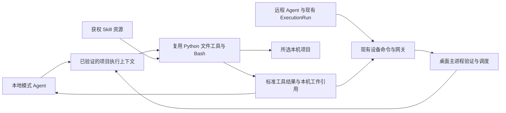

## Context

动机与范围见 [proposal.md](proposal.md)。本文是待实施设计，不代表现有能力已通过验收。

基线：`origin/master@8f1b19f1e72db0b46772f78f9c760b04b1836428`。当前工作分支为 `rdai`。本次核对发现：

1. master 的 `WorkspaceSelector.openProject()` 调用原生选择器，再提交项目选择；`Agent.apply_project_dir()` 改变文件及 Shell 工具 cwd，SkillManager 与记忆保持原工作空间。项目提示要求业务产出留在项目目录。
2. 当前 Web 实际加载 `channel/web/static/js/console.js`。`wsSelChooseLocalDir()` 通过 `chooseWorkspace/bindContext` 仅建立设备文件引用；改未加载的拆分脚本不能修复现有页面。
3. `console.js` 两处 `(crypto.getRandomValues || fallback)(bytes)` 丢失接收者。在 Electron 33.4.11 / Chromium 130 的隔离复现中，原代码只有 `chooseWorkspace` 调用，toast 为 `Illegal invocation`；内存修正后才调用 `bindContext`。安装 ID 的异常回退不持久化，连续值也不同。该证据只证明缺陷，不代替本 change E2E。
4. `desktop/src/main/remote/device-ops.ts` 只实现 `list/stat/search/read_text`；现有 fs-guard 是只读路径 helper，不支持脚本。`remote` 启动分支不启动 Python 业务后端。
5. 当前实际项目 handler 位于 `channel/web/fork/handlers/workspace.py`；`project_browser` 和 `project_store` 将 database 项目限定在个人项目根。仅套用 master 旧接口会被拒绝，也不能直接删除该限制。
6. `agent/protocol/agent_stream.py` 已集中完成工具筛选、权限检查、执行、取消及工件事件。`integrations/desktop/commands.py` 已有持久命令、连接租约与去重接缝。两者必须复用。
7. 当前 `agent/permission/isolation.py` 自述为参数级边界，且现行配置缺省可为启用；不能把此配置值当成本机任意脚本实际受隔离的证据。新执行能力必须有独立平台验收门槛。

## Goals / Non-Goals

**Goals:**

- 本地、远程模式均在用户所选本机项目原地执行；工具行为和技能内容尽量与 master 一致。
- 用同一组 Python 工具类支持本地直接执行和远程调度，不另写一套 Node 文件工具或 Skill 引擎。
- 在现有业务运行中体现本机执行，保证来源、取消、未知结果和产出定位准确。
- 维持现有多租户边界，通过原生项目授权形成精确的本机根例外。

**Non-Goals:**

- 不回退为 master 的整套旧桌面界面，不取消统一 Web 工作台或企业认证。
- 不在客户端再运行一个 LLM 决策循环，不同步全部远程 Agent 数据、知识库或服务器环境。
- 不让项目选择成为所有 Skill、所有本机目录、任意网络和凭据的通用授权。
- 不提供全盘文件同步、离线模型聊天、自动唤醒设备或持久后台任务执行。
- 不承诺原地执行可回滚任意脚本已完成的写入，也不承诺所有数据始终留在电脑上。

## Decisions

### D1. 固定上游参考并复用当前仍保留的 master 实现

| master 接缝 | 当前接入方式 | 允许的改动 |
|---|---|---|
| `desktop/src/main/index.ts` 的 `select-directory` | 抽取为可信原生选择服务，本地 React 与 Web adapter 共用 | 返回范围化选择记录；远程页面不直接取得通用文件系统 IPC |
| `WorkspaceSelector.tsx` / `apiClient.selectProject` | 保留服务器项目选择；“本机项目”使用来源明确的 adapter | 展示准备状态、取消、来源与错误 |
| `agent/workspace/project_store.py` | 保留普通项目存储/最近项目逻辑；新增本机绑定引用分支 | 不放宽普通 `set_project_dir()` 的个人根校验 |
| `Agent.apply_project_dir()` / `effective_cwd()` | 当前实现优先复用；本机执行上下文提供获权实际根 | 不调用全局 `os.chdir()`，不修改共享 Agent Profile |
| `read/write/edit/bash/ls/search_files` | 共用当前已合并 master 的 Python 实现 | 必要的上下文、事件、路径解析和进程启动依赖注入 |
| SkillManager / loader | 使用同一技能发现、选择和提示构建逻辑 | 增加只读版本包来源与执行端资源定位 |
| `_build_project_workspace_section()` | 复用项目/系统目录分离文案 | 远程上下文使用逻辑位置与真实平台信息 |
| 工具结果/工件事件/文件卡片 | 沿用结果外形与现有聊天事件 | 增加来源分支及本机引用 |

实施先以固定 SHA 与当前文件作局部 diff，记录“已保留/直接复用/最小适配/新增及原因”。避免 cherry-pick 整个历史功能提交导致覆盖当前权限改造。新增模块只围绕传输、作用域、缓存、平台启动和本机产出投影；不会 fork 第二份工具实现。替代方案“按旧目录状态重新设计一套工具”维护成本更高，因此不采用。

### D2. 会话持有带来源的项目，运行固定执行上下文

会话新增可选 `execution_target`，只由授权层解析，不接受模型提供的身份字段：

| 内容 | 值或含义 |
|---|---|
| `location` | `backend` 或 `desktop` |
| `device_id/workspace_id/binding_id` | desktop 来源的既有不透明标识 |
| `grant_version/generation` | 授权版本与当前文档/选择代次 |
| `project_mode` | 明确区分 `readonly-input` 与 `project-execution` |
| 运行关联 | 既有 tenant/user/agent/business_session/run/tool_call ID |

本机绝对路径由客户端授权注册表保存；远程服务器不将其作为自己的 cwd 或本地路径传给普通工具。在本地模式，可信同机后端解析授权根后调用原有 cwd 逻辑；在远程模式，本机 worker 解析实际根后调用同一逻辑。

运行开始固定目标，目录切换只作用于下一轮。旧轮次可以在仍有效的旧 grant 下结束；显式撤销、账号/租户/origin 切换必须取消。仅界面切换聊天不取消其他本人合法运行。Agent 实例缓存及并行工具调用采用不可变运行上下文/按轮工具视图，不能在运行中改写共享工具对象 cwd。团队会话交给另一 Agent 时重验实际发言 Agent 的技能/工具资格；绑定不匹配就拒绝，不借宿主 Agent 资格执行。

选择链路为 `选择中 → 验证绑定 → 准备执行环境 → 就绪`，失败留在明确错误状态；保留旧选择时须显示其仍生效。页面内任意旧 Promise 回调按选择代次丢弃。两个原生 crypto 调用先修正；稳定安装 ID 最终迁至主进程唯一生成与保存，作为定位而非身份。兼容已有有效 ID，失效 ID 重新关联设备，不盲删历史设备记录。

### D3. 本地模式使用直接调用，远程模式使用同一执行器的传输适配

拟新增 `agent/desktop_execution/` 作为 headless worker 入口与工具工厂适配，新增 `desktop/src/main/project-execution/` 管理 worker 生命周期、stdio、授权及回执。名称是实施组织建议，不是另一个运行时产品。

本地模式使用本机后端的原工具执行入口；需要隔离的脚本仍经相同平台启动器。远程模式按需启动随桌面安装的 Python worker，只加载获准工具及必需配置，不启动 Web 服务、scheduler、模型客户端或新 Agent 决策循环。远程 Agent 使用代理工具，代理保持原 schema，但由本机运行时能力提供平台相关描述。授权在 `agent_stream` 原门禁内完成，之后才转发；不能通过在权限检查之前替换工具名称来绕过黑白名单。

默认必交付 `read/write/edit/bash/ls/search_files`。`send` 产生本机工件引用；`web_fetch/browser` 仍按各自后端运行能力执行，但文件落点必须显式转成本机输入，或拒绝该落盘动作。所有声明 `cwd` 的工具在发布前逐项分类；未适配者不自动落回服务器。远程知识、记忆和 MCP 的实际数据/服务位置保持不变。其结果可以成为任务输入，不能透传不被接收端理解的绝对路径。

路径定位使用类型化资源引用：项目相对路径、Skill 包相对路径、获权后端输入引用。命令通过 `COW_PROJECT_DIR`、`COW_SKILL_DIR` 等执行端变量定位资源，复用技能相对资源查找方式；不对 Shell 命令或源码做服务器路径的全局字符串替换。工厂生成提示时提供本机 Shell 语义。协议不主动同步宿主根映射；用户命令如 `pwd` 或异常文本可能包含本机路径，作为获权工具结果处理，不作授权依据，也不承诺任意脚本输出已被完美脱敏。

### D4. 明确原地授权，保持普通项目接口边界

选择和授权继续由可信原生主进程完成。新增“本机项目执行”用途，不复用旧 `readonly-input` grant 获得写权限。用户界面显示服务器、Agent、目录、允许的读写/执行范围以及工具结果会传回服务器；沿用现有权限模式和适用审批，不增加每条普通文件读取的重复确认。

本地后端只接受主进程登记的 loopback origin、现有可信传输、已登录作用域和原生选择记录；页面输入路径、本机令牌单独存在、管理员身份都不是目录授权。登记记录有用途、代次及可消费选择标识；本机 project binding 的解析分支同时服务执行与文件面板。普通 `/api/projects/browse`、选择、导入及复制仍按个人根规则工作。

已有项目存储 API 不接受 `desktop:` 字符串作为磁盘路径；新增绑定存储只保存带来源的引用，兼容原字符串项目记录。当前个人根限制不可全局删除。文件 API 也不通过放宽 `_is_path_allowed()` 处理任意本机路径，应通过已验证来源 resolver 访问。

### D5. 任意脚本的隔离是平台执行器职责，不能由 cwd 代替

优先复用现有工具、权限和取消语义，在进程启动接缝施加实际边界。隔离策略输入为：项目根读写、当前获权技能包只读、该运行临时目录读写、必要解释器/系统库只读，以及明确网络/凭据能力。身份库、主进程配置、其他用户/租户缓存及未授权 home 路径不进入允许集合。

平台实现为受限制的独立执行进程，由 macOS / Windows 启动适配器建立文件访问和子进程资源边界；Windows 进程树管理与 macOS 进程组管理负责取消，但本身不作为文件隔离证明。具体系统启动 API 必须通过阶段 0 的动态脚本逃逸探针选定并记录，而不会以当前参数解析规则顶替。此处“平台实现待探针确认”只影响底层适配，项目、技能和传输架构不变；没有实现的平台仍是未完成交付项，不能以关闭开关结项。

远程 worker 不承载业务 Bearer或模型密钥，不继承完整主进程环境。远程端每命令生成一次性启动许可，客户端核对后才能运行；心跳延续受期限约束的在途许可。只读会话、作用域撤销、审批未通过、配额耗尽均在副作用前拒绝。旧 `execution_isolation=true` 和“另一个执行器已验收”不自动开启本机脚本。

### D6. SkillManager 继续选择技能，新增版本包部署

服务端按当前用户、租户、Agent 和 `skill.use` 构建可用技能清单；仅为将使用的技能生成包 manifest。每包有 skill ID、内容版本/摘要、声明平台、必需文件及每文件大小/摘要、运行时与依赖清单。执行计划固定版本，按任务引用计数保留在用包。

缓存位于桌面 app userData 下的作用域目录，按 origin/tenant/user/skill/digest 隔离，使用不透明目录名；临时下载完成校验后原子发布。默认只读，不复制 `.env`、身份库、服务端全局配置、无关用户资料、symlink 或包外文件。不把原有 `sync_to_workspace` 整目录删除逻辑用于并发在用包更新。

worker 将该目录作为原 Skill loader 的资源来源；保持 Skill 说明、脚本与模板内容尽量原样。解释器从现有桌面 Python 打包流程提供。依赖优先构建期锁定并随包交付；额外依赖由声明清单和受控安装流程准备到隔离环境，不运行模型给出的任意安装命令。缺失依赖返回 `dependency_missing`，硬编码服务器路径返回 `resource_unavailable/incompatible_skill`，不静默改在云端执行。

技能缓存和项目是不同根。原有共享知识/技能维护提示保持；生成业务报告采用本轮项目输出规则。仅在未选择项目时沿用本人 `outputs` 提示。既有服务端技能版本尚无统一版本号时以规范化 manifest 的内容摘要作为不可变版本，不新增一套人工版本管理系统。

### D7. 扩展现有命令账本，不重建运行编排

现有 command/outbox/lease 可继续用来寻址与投递，新增执行 v2 schema；具体 envelope、状态、额度与错误见 [execution-contract.md](execution-contract.md)。只读 v1 原样兼容，不就地扩大其 `ops` 含义。

服务端 `ExecutionRun + tool_call_id` 是业务真值。客户端持久回执表只记录是否开始及实际结果；调用 ID、作用域、参数摘要、项目授权和技能版本均参与核对。主进程在副作用之前 fsync 开始意图；完成后保存结束回执再回传。同 ID 不同摘要拒绝；重复完成返回原结果；开始过但结果丢失一律待确认。对一般 Bash 不声称 exactly-once。

同一实际项目（由设备端根身份识别）有副作用调用串行，跨会话也共用调度键；标准编辑操作沿用源版本校验。外部编辑器同时修改文件仍可能形成冲突，必须报告；任意脚本不能保证整批文件事务回滚。后台 Bash 句柄按设备/项目/运行命名空间保存，输出轮询与 kill 转给原 worker。

断线期间不接新命令；默认 30 秒存活期内恢复同一有效授权可继续，超时终止进程树，已写文件不删除。仅重试查状态和传输，不自动重跑有副作用操作。取消先标记请求，再等待进程树实际结束，无法确认时保留 unknown，而不是发一条“已取消”就结束。

### D8. 本机工件沿用现有事件与卡片，访问走来源适配

现有 artifact 事件增加 `source=desktop`、device/workspace、run/tool_call、relative_path、source_version 及基础文件信息。本机 worker 验证文件存在后创建引用；主进程维护引用到获权路径的映射。服务端仅保存元数据以重建历史，不对该引用调用本机 `os.stat()` 或拼 `/api/file?path=<客户端路径>`。

前端文件面板和卡片增加来源 adapter：后端文件沿用原 API；本机文件经专用窄化 bridge 请求元数据、有界预览或打开意图。主进程再次检查当前用户、来源 grant 和版本。HTML/可执行预览使用无 bridge 的隔离视图及限制性 CSP；预览文档无原生 API。普通预览可以使用短生命周期本机 blob/受保护资源 URL，但不得向远程页面提供永久 file URL 或通用磁盘根。

历史按生成时来源定位。原目录授权仍有效才能打开；重启候选需要重连；设备离线显示“文件在设备 A，当前不可访问”。同路径版本变化显示“文件已修改”，不冒充历史内容。复制完整路径由主进程直接写剪贴板并返回成功，不把宿主根作为后台元数据。

本机默认只保存原文件，另存为是明确用户动作；上传/共享到服务端复用现有 transfers/publish 和配额，新增独立服务端副本引用。工具输出和必要摘要仍经服务器及模型，UI 明确说明此区别。

### D9. 唯一数据归属与增量迁移

| 数据 | 权威位置 | 迁移策略 |
|---|---|---|
| 身份、配对、权限、审批、额度 | 现有服务端身份及治理服务 | 不复制到本机数据库；worker 使用短期调用许可 |
| 会话执行目标 | 原会话/项目偏好 + 已有 binding/workspace 记录 | 可选来源字段；旧记录按 backend/readonly-input 解释 |
| 本机根映射及活动 grant | 主进程内存 + 仅本机候选 | 不上传绝对路径；候选不自动恢复授权 |
| 业务运行/工具调用 | 原 ExecutionRun 与聊天工具事件 | 同一 run 不另建客户端 Agent run |
| 远程投递/终态 | 原 desktop command/outbox | additive 字段和 v2 payload；旧命令保持原含义 |
| 开始意图/完成回执 | 客户端持久 journal | 新建独立非业务回执库，受本机用户保护 |
| 技能包 manifest /缓存 | 服务端获权 manifest /客户端版本目录 | 增量部署、原子启用、在用引用阻止回收 |
| 本机工件 | 原文件客户端、元数据服务端 | 加可选 source 字段，旧文件与消息不改写 |

数据库迁移编号在实施时按最新序列分配。命令结果元数据保留与现有命令期限一致，默认 7 天；未知结果回执直到用户处理且过期窗口结束前不得清理。即使回执已回收，命令过期时间也使旧命令不能被重新执行。账本不记录秘密、完整环境或默认无限长 stdout。

### D10. 阶段与启用门槛

| 阶段 | 可实施交付 | 进入下一阶段/启用所需证据 |
|---|---|---|
| P0 基线和契约 | 固定上游 diff、缺陷复现、平台执行探针、协议和跨 change 协调 | 复用清单、真实路径/进程探针结论；明确未满足的平台 |
| P1 本地项目 | crypto 修复、原生绑定、本机 cwd、共享工具、文件面板 | 原生选目录到文件生成的本地闭环；个人根限制回归 |
| P2 远程执行 | worker、现有网关扩展、双端授权、去重取消 | 实际远程服务驱动真实桌面工具结果，故障注入通过 |
| P3 Skill 与产出 | 版本包、依赖检查、本机卡片与历史 | 未改动内容的代表技能完整处理 Excel/文档，结果可打开 |
| P4 平台发布 | 真实打包、平台隔离、升级/回退、验收文档 | 本地/远程 × 发布平台矩阵和治理切片证据齐全 |

拟新增 `desktop_project_execution`、`desktop_project_scripts` 独立开关，初始关闭；既有 `desktop_local_files` 不扩大含义。最终能力是服务端允许、客户端协议、设备能力、当前用户/Agent 权限、项目 grant 和实际平台验收的交集。只有读写通过可以明确开放读写子集，但不能据此宣称本 change 的 Skill 脚本目标已完成。所有用户要求覆盖的本地/远程模式必须完成；按平台逐步灰度不等于遗漏平台可勾选结项。

## Risks / Trade-offs

- **兼容 master 与企业隔离有差异** → 复用工具业务实现，隔离仅放在执行启动/资源解析边界；直接移植旧无作用域 API 不可接受。
- **技能依赖跨平台不一致** → 固定包和实际运行时能力，缓存只读；逐技能给出缺项，不把未适配宣称为可运行。
- **远程参数或模型命令访问本机** → 原生用途授权、逐次服务端许可及本机边界共同限制；页面没有 exec IPC。
- **原地执行修改源文件** → 沿用用户任务/权限模式和适用审批；默认报告写新产出路径，编辑有版本检查；不承诺任意脚本自动备份或回滚。
- **断线重复运行** → 持久开始/完成回执、截止时间、状态查询及 unknown 人工确认；拒绝用重跑消除不确定性。
- **远程任务的操作系统仍按服务器描述** → 工具描述及执行提示取客户端能力；Windows/Linux/macOS 交叉验证。
- **文件原地保存但远程模型仍看到内容** → 明确工具结果/摘录流向，不自动上传原文件，也不作全本地隐私承诺。
- **现有依赖切片仍无真机验收** → tasks 标明实际缺口、验证环境与测试证据；实现 mock 或单纯开关关闭不能作为完成。

## Migration Plan

1. 只增加字段、v2 协商及 worker 入口，新能力保持关闭；旧命令/只读目录/普通项目测试先通过。
2. 发布能区分 source 的服务器及新桌面；旧客户端无 v2 能力时维持只读。
3. 单平台本地、远程真实验收后灰度开启；用户通过“打开本机项目”重新形成执行授权。近期候选不升级权限。
4. 不迁移旧产出、不重写历史消息、不删除当前个人工作区和服务器文件。历史新增 source 缺省按 backend 解析。
5. 回退时先封锁新执行并取消/确认在途任务，再关闭新版开关；保留客户端回执、旧项目原文件及未知状态，不能重新标记成只读命令重投。数据库使用增量保留兼容，旧端看不懂本机卡片时显示可解释的不可用状态。

## Open Questions

以下仅为实施参数，不改变架构或功能范围：

- 首批随桌面发布的 Python 文档/表格库精确版本，以当前打包锁定清单及兼容验证结果确定。
- macOS / Windows 最低发布版本与签名产物矩阵按现有客户端支持表核对；未验收平台明确保留任务，不能推断支持。
- 新数据库迁移编号、包缓存默认磁盘预算由实施时最新基线分配；默认命令限制见 `execution-contract.md`，上线收紧不得突破其上限。
