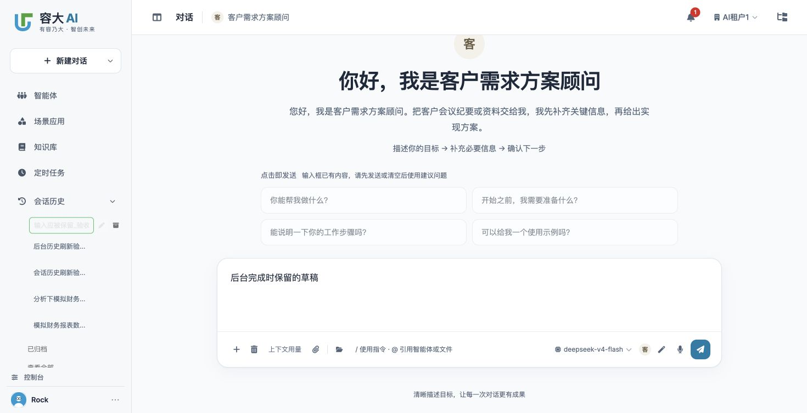
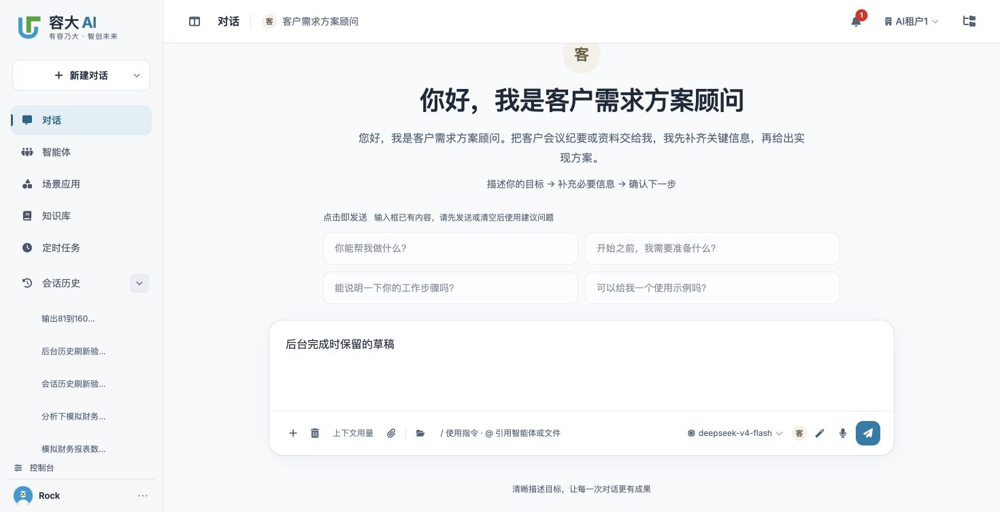

# 会话历史刷新实施与验收

日期：2026-10-01。实际页面：`http://localhost:9899/chat`。

## 实施范围

业务代码仅修改实际装载的 `channel/web/static/js/console.js`：

- 正常文字／语音发送获确认后刷新已有历史入口，控制命令的同步回复、失败发送及未发送新会话不作为保存确认。
- SSE 完成的历史刷新及首次标题处理移到当前会话显示保护之前；标题及发送时的会话、智能体、身份和租户复用现有流缓冲，重建流保留标题，完成后清空一次性字段。
- 自动标题显式传原 `agent_id`，保存成功后刷新；已有推送／轮询回复成功时刷新，空轮询不刷新；重新展开最近会话重新读取。
- 沿用请求序号，增加身份／租户检查及一个侧栏待刷新标记。请求前和结果应用前检查编辑态，保存／取消后补读，保存时等待 PUT 完成。
- 迟到的发送确认仍归属原会话，不将当前新会话的输入框切为原请求的中止状态。

没有新增同步模块、事件总线、队列、单飞控制、空会话写入、草稿预览行、数据库迁移或新界面。工作区同期桌面功能改动保留；其实现不属于本 change。

## 自动回归

以下前端回归合计 **92 项通过**：

```sh
node --test tests/test_session_history_refresh_frontend.cjs tests/test_session_history_frontend.cjs tests/test_sidebar_session_rename_frontend.cjs tests/test_sidebar_session_archive_frontend.cjs tests/test_workbench_sidebar_launch_frontend.cjs
node --check channel/web/static/js/console.js
```

新增回归执行实际发送、SSE、重建流、标题和轮询函数，覆盖未回答即刷新、前后台完成、首次标题至多一次、原 owner、迟到确认、身份变化和未发送新会话。侧栏回归覆盖读取途中开始编辑、成功／失败读取保留输入、保存后才补读、取消后补读、乱序读取、身份／租户变化、重新展开、隐藏授权入口以及旧／新布局的 10／5 项预览限制。原历史搜索、编辑、归档及会话恢复回归通过。

以下后端既有回归 **29 项通过**，确认本修复继续依赖现有查询与隔离规则：

```sh
.venv/bin/python -m pytest -q tests/test_session_history_search.py tests/test_conversation_tenant_isolation.py tests/test_conversation_store_owner.py
```

另执行账号回归 `tests/test_sidebar_account_frontend.cjs`，结果 56/61 通过。以实施前的 `console.js` 快照重跑得到相同的 5 项失败（legacy／public 身份与登录初始化断言），并非本 change 新增失败。夹具补齐当前脚本已有的桌面依赖及新增身份快照依赖；未修改账号业务行为。

## 实际页面

- 重载后确认实际装载带版本的 `/assets/js/console.js`。验收读取的静态文件与工作区 SHA-256 完全一致；随后最后一次局部修正再次重载，页面资源版本变为 `1a0f7473954`。
- 新建但不发送时，侧栏保持原 5 个已保存记录，没有添加未保存行。
- 首次正常发送的新记录 `session_a4e50cef-e679-4c5f-a6a7-2f485df6b152` 在回答出现前已进入侧栏，标题为「新对话」；当时消息区 assistant 数量为 0，发送按钮仍为「中止」。没有打开完整历史或刷新整页。
- 前台完成及标题保存后自动显示最终标题；另两条验收记录的标题为「会话历史刷新验收」及「后台历史刷新验收1-80」。
- 第三条生成中切到新会话，输入草稿「后台完成时保留的草稿」，并在原侧栏行输入「输入应被保留_验收」。后台完成后两处输入都保留，当前新会话消息区仍无 assistant 消息。
- Escape 取消行内编辑后，原记录刷新为最终标题「输出81到160」，当前草稿保持。收起再展开显示相同权威列表。
- 实际页面抽查采用当前新版侧栏；旧版 10 项与新版 5 项的受影响读取／渲染入口由上述实际函数回归覆盖，不扩展多端组合验收。

保存的页面证据：





浏览器留有三条明确的验收会话，未删除业务历史。验收草稿已清空，页面返回未发送的新会话。

## 发布与回退

沿用现有静态资源版本机制，无后端接口变更、数据库迁移或数据回填。发布本次静态脚本即可；回退仅撤销本 change 的局部代码，不回滚会话数据或同期桌面改动。
