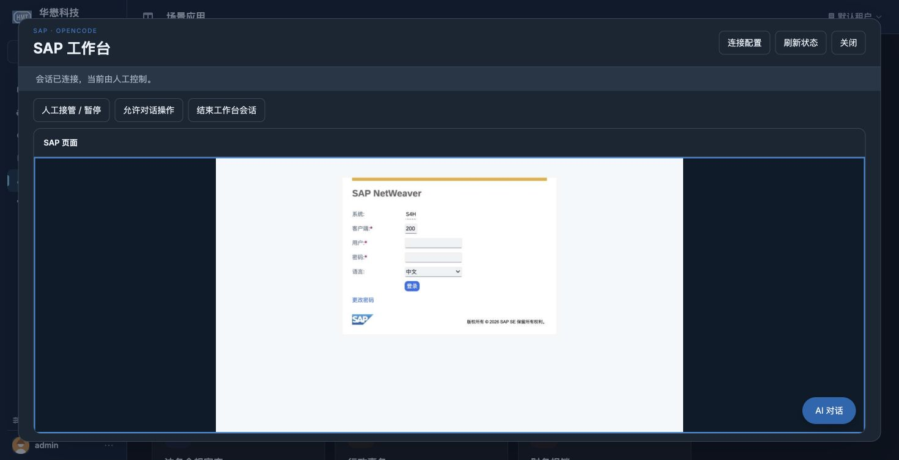
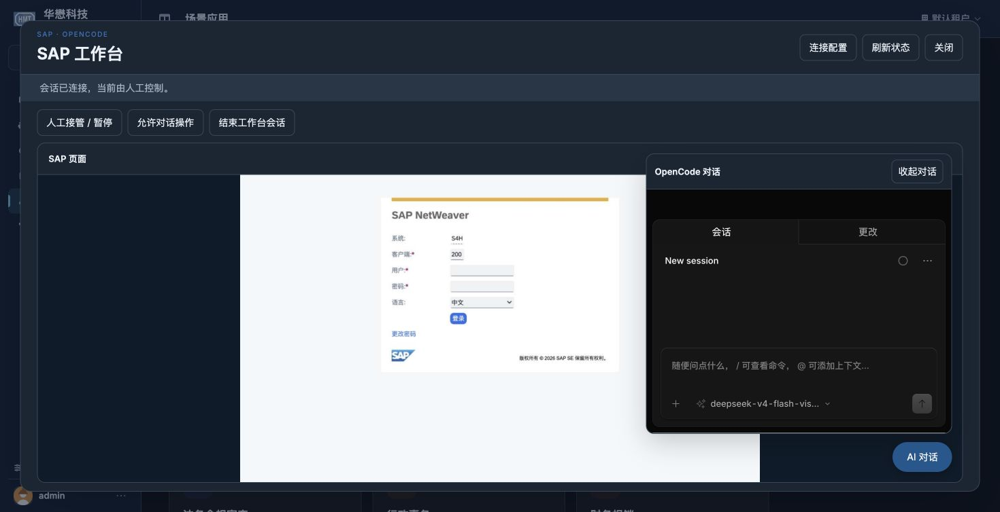

# 卡片普通区域直接新建工作台会话

2026-10-04。用户要求点击 SAP 工作台卡片除「配置」按钮外的区域直接进入新建会话。

## 行为及修改范围

普通卡片、选择器及已登记直达入口继续共用分发链；共享 adapter 只改 SAP 分支一行，以 `new-session` 调用场景挂载器。挂载器成功加载当前配置且可视能力就绪后，直接调用既有新建接口，挂载 SAP 浏览器及默认收起的嵌入式 OpenCode；不再要求额外点击新建按钮。不自动恢复历史、不发送提示词或调用模型。

「配置」按钮沿 settings 打开表单，不创建会话。配置失败、能力关闭、离页保护拒绝及迟到配置不会触发创建；创建中或已绑定时重复普通入口不刷新配置或重新挂载。配置加载期间的重复入口由当前代次决定唯一有效结果。关闭视图后迟到结果不创建资源，现有创建幂等标识及显式恢复合同保留。

程序改动为 `Scene/_shared/frontend/adapter.js` 的 SAP 分支、`Scene/sap_workbench/frontend/workbench.js` 及该资源摘要；测试补齐行为用例。其他场景、普通 Agent/coding、MCP、后端、桌面主进程和 OpenCode 核心未作本次修改。

## 验证

```sh
node --test tests/test_sap_workbench_frontend.cjs tests/test_scenes_frontend.cjs tests/test_coding_frontend.cjs
.venv/bin/python -B -m pytest -q tests/test_sap_workbench.py::test_catalog_assets_and_scene_open_do_not_create_sessions
```

前端组合 **96 passed / 0 failed / 0 skipped**，含六项新增场景行为测试；资源路由 **1 passed，0.64 秒**。直接新建只有一次配置读取与一次 request_id 创建，无历史列表请求；覆盖不可用/认证失败、两次加载乱序、创建中及已绑定重复入口、关闭后迟到结果。既有配置按钮、保留普通场景上下文和不回退 Agent 的测试通过。

服务加载与 Chrome 验证结果见 [本次重载快照](card-create-session-services-reloaded.json)。本次界面入口验收不恢复被暂停的 SAP 业务工具或模型操作检查；完整 change 仍为 **42/57，剩余 15 项**，不归档。

Chrome 实测：点击「配置」只展示表单，会话数保持 8；关闭配置页后点击卡片标题，自动进入“正在准备 SAP 与 OpenCode 会话”，随后显示已连接的 SAP 登录页，会话数增加为 9。没有点击准备页的新建按钮，也未输入 SAP 登录凭据。右下角按钮展开实际原生 OpenCode 的空白 New session，DOM 确认为工作台内一个 iframe；测试后收起并保留用户工作台。未发送聊天消息、调用模型或 SAP 业务工具。Web/桌面后端沿完整原环境重载，18 项公共资源及匿名 API 检查通过，19 份加载源码已冻结；没有重建 OpenCode。




