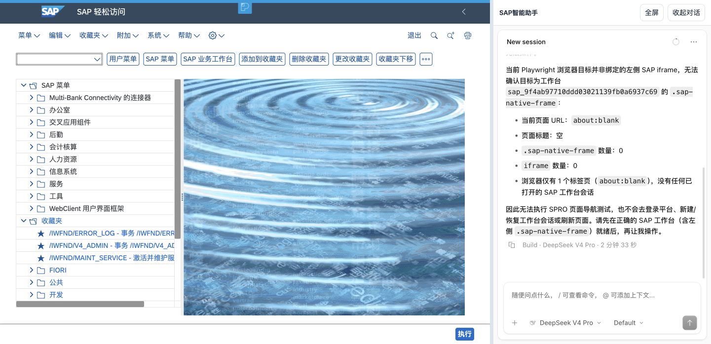

# 原生 iframe 对话导航实测

2026-10-04。用户恢复了 OpenCode 对话驱动 SAP 的实际导航测试。本轮使用 Google Chrome、当前真实工作台和原生 OpenCode 配置；范围只含页面导航，不含单据输入、修改、保存、过账或配置修改。

## 结果

| 测试 | 左侧起始页面 | 实际结果 | 判定 |
| --- | --- | --- | --- |
| 对话输入「打开 ME23N」 | SAP 轻松访问 | 助手回复已进入 ME23N，但当前左侧标题和页面没有改变 | 未通过，回复与可见目标不一致 |
| 对话输入「返回 SAP 轻松访问（/n）」 | ME23N 采购订单显示页 | 通用 Playwright 进入平台、点击工作台入口和恢复按钮；原绑定被替换，没有在原左侧完成返回及回读 | 未通过，目标绑定与会话保持失败 |
| 对话输入「打开 SPRO」，明确限定当前绑定 | SAP 轻松访问 | 助手调用 snapshot / tabs / evaluate，报告自己的浏览器只有 about:blank，没有当前 .sap-native-frame；没有执行导航 | 未通过，当前页面控制通道缺失 |
| 直接操作左侧事务代码栏 `/nME23N` | SAP 轻松访问 | 进入采购订单显示页，独立回读标题 | 参考操作通过，不计为对话成功 |
| 直接操作左侧事务代码栏 `/nSPRO` | SAP 轻松访问 | 标题为「定制：执行项目」，存在「SAP 参考 IMG」按钮 | 参考操作通过，不计为对话成功 |
| 直接操作左侧事务代码栏 `/n` | SPRO | 返回 SAP 轻松访问 | 参考恢复通过 |

第二条测试的持久工具记录包含 `playwright_browser_navigate` 到平台入口、点击「场景应用」「SAP 工作台 开始对话」「刷新状态」「恢复已有会话」。原会话随后为 closed，新会话为 ready；该副作用不能算作对原左侧的导航成功。保留历史记录，没有删除会话或改写工具输出。

## 原因与验收边界

当前原生模式继承 OpenCode 的通用 Playwright MCP 配置，但没有把它连接到工作台可见的左侧 iframe。场景 runtime 的 iframe 模式仍对页面桥返回 `iframe_page_control_unavailable`，native 适配器没有注册旧画面模式的页面工具。

能够登录和嵌入 SAP、发现 MCP、模型回复成功，均不证明能够控制同一可见页面。当前必须补齐绑定当前工作台页面的操作通道，并以该左侧页面独立回读确认动作结果；不能靠提示词或另一个浏览器里的 SAP 页面代替。

本轮没有改动运行控制代码，没有新增或保存业务单据。5.7、7.2 等原计划验收仍未完成，总进度保持 49/64；change 不归档。历史「暂缓实际操作检查」只对当时轮次成立，本轮已按用户新指令恢复上述有限导航测试。

