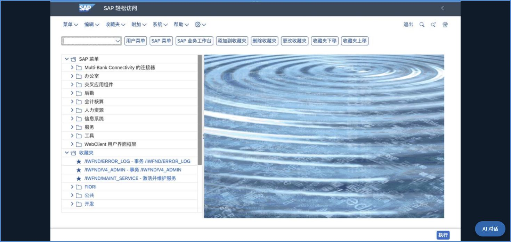
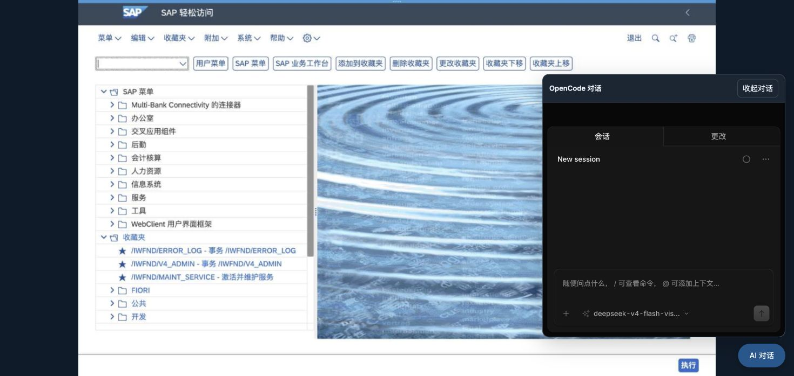

# 会话页面只显示 SAP 画面及嵌入式对话

2026-10-04。按用户红框范围隐藏工作台标题、状态栏、会话操作按钮、SAP 区域标题和画面控制栏，移除主区域内边距及边框。程序仅修改 `Scene/sap_workbench/frontend/workbench.css` 和对应资源摘要；`data-live=true` 限定已绑定会话视图，配置与未绑定准备页仍使用原布局。SAP 图像保持比例及输入坐标映射，对话仍为原生 OpenCode iframe。

Chrome 实测：刷新宿主页，经卡片「配置」→「返回工作台」→「恢复已有会话」，恢复原 SAP Easy Access 登录状态，未创建新工作台会话。配置和准备页入口可用；进入会话后所有额外区域的 computed display 为 none，SAP canvas 边界 x=0、y=0、width=1470、height=698，与浏览器可用视口一致。AI 对话按钮展开同一个绑定的原生 OpenCode，收起后回到纯 SAP 画面；未输入凭据、SAP 业务内容或发送模型消息。保留用户页面，未重启服务。

资源路由回归：`.venv/bin/python -B -m pytest -q tests/test_sap_workbench.py::test_catalog_assets_and_scene_open_do_not_create_sessions`，**1 passed，0.65 秒**。此次没有修改 JavaScript、后端或 OpenCode 核心，实际 SAP/OpenCode 业务工具检查仍按原安排暂缓。

Web（9899）及桌面后端（9876）公共 CSS 均返回 200，字节与当前源码一致；两份 SAP 前端资源摘要匹配。`git diff --check` 和 `openspec validate add-sap-workbench-scene --strict` 通过。

