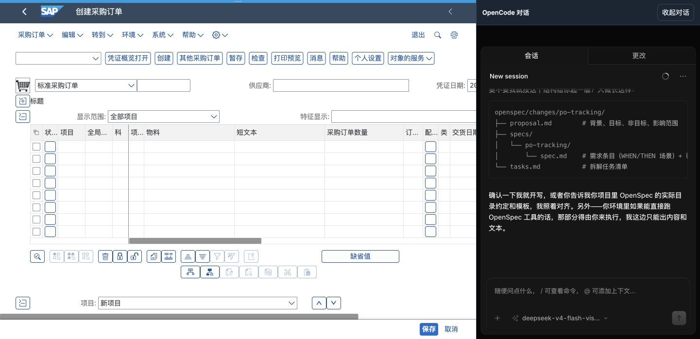

# OpenCode 页内对话布局（2026-10-04）

按用户最新要求，将右下角悬浮对话改为页面右侧的嵌入区域。SAP 与 OpenCode 占据各自的布局空间，区域之间不重叠；收起对话后 SAP 恢复整个工作区。展开期间隐藏右下角按钮，由对话区域头部按钮收起。CSS 在 720px 及以下改为上下排列；本次没有另做窄屏现场验收。

## 改动与部署

- 程序仅修改 `Scene/sap_workbench/frontend/workbench.css`，以及 `Scene/source-manifest.json` 对应 CSS 摘要。既有前端挂载/会话、后端及 OpenCode 核心没有修改。
- CSS 摘要由 `b4e65a1b22559cf965bf8657d35951f9d061cb7cf06539e01b31447c5fb2c6e0` 更新为 `d091c1bd8ea38e049e3512394d46fc8376f2e5f63412baff8ae940f240f18cde`。
- Web 9899、桌面后端 9876 的 CSS 资源均返回 HTTP 200，返回内容摘要与当前源码一致；没有重启服务或重新创建会话。
- 当前 Chrome 工作台正在显示用户打开的采购订单页面和对话。通过浏览器开发调试接口热更新该页面已加载的场景样式表，避免刷新 SAP 和正在生成的回复。该页面保留更新后的样式；其他已打开页面正常重新加载时使用服务器新 CSS。

## Chrome 验证

工作区 1441 × 698。展开后 SAP 区域位于 `(0, 0)`，尺寸约 `979.88 × 698`；OpenCode 区域位于 `(979.88, 0)`，尺寸约 `461.12 × 698`。对话区域计算样式为 `position: static`、`border-radius: 0px`、`box-shadow: none`，完整填满右侧空间。OpenCode iframe 占满头部以下区域，输入框和收起按钮可见。

收起后 SAP iframe 恢复 `(0, 0, 1441, 698)`；之后对话再次展开。浏览器 DOM 节点编号核对确认 SAP 和 OpenCode 的两个 iframe 仍为同一节点，未卸载重建；没有发送模型提示词、切换模型、操作 SAP 字段或提交业务。

## 验证结果

- `node --test tests/test_sap_workbench_frontend.cjs tests/test_scenes_frontend.cjs tests/test_coding_frontend.cjs`：100 passed。
- 场景入口/资源测试：1 passed。SAP 三项资源的清单摘要全部匹配。
- 全局源摘要测试：主测试显示 2 passed、236 子测试通过、6 子测试失败。六项失败位于采购投标的 `document_to_md.py` 以及财务报表审查的 `requirements.txt`、`setup.py`、`SKILL.md`、`parsers/pdf_parser.py`、`strategies/related_party.py`。逐项核对确认文件字节及清单记录均与 HEAD 相同，属于既有不一致，本次未修改这些文件或摘要。
- `openspec validate add-sap-workbench-scene --strict` 与 `git diff --check` 通过。

本次只完成布局调整；完整 change 保持 42/57、剩余 15 项，不以此界面验证代替原计划的 SAP 工具/业务、提交、远程部署和桌面完整验收。
