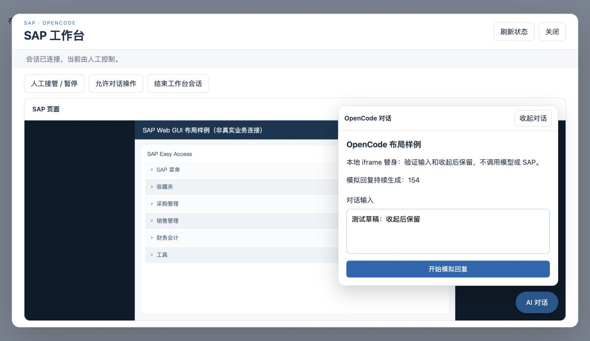
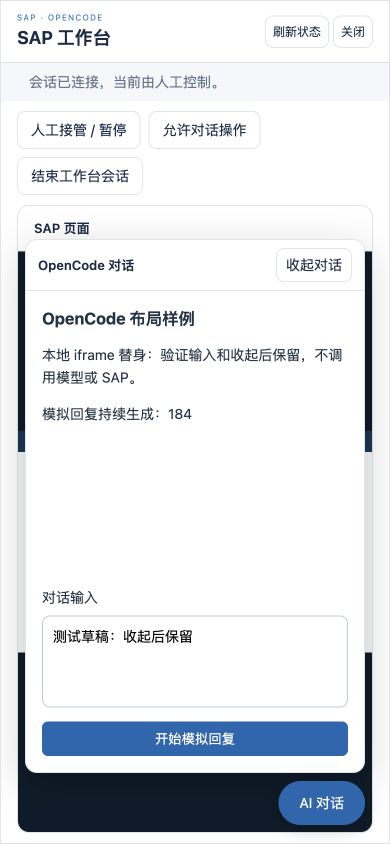
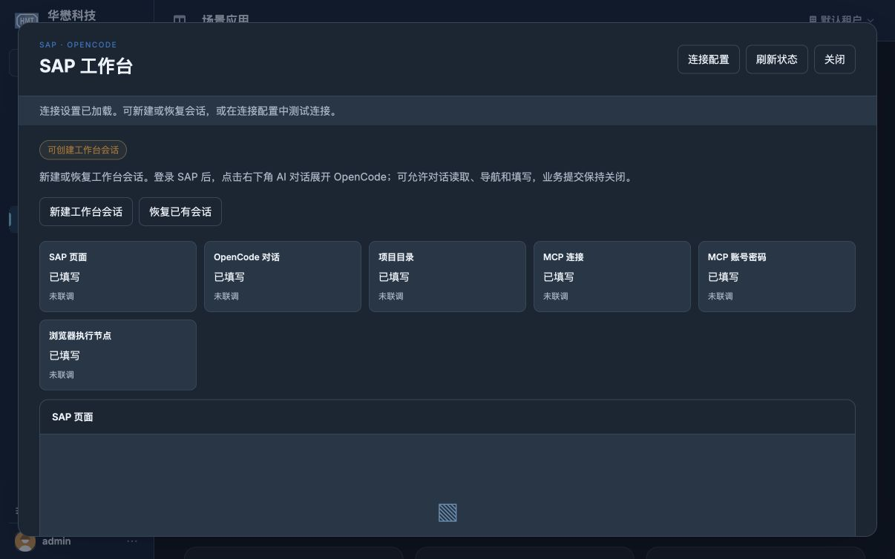

# SAP 主界面与浮动对话布局

更新于 2026-10-04。按用户“请修改”实施最新方案：进入工作台会话后以 SAP 为主界面，右下角「AI 对话」按钮展开嵌入式 OpenCode。沿用既有会话绑定、专属 Chrome 实时画面及原生 OpenCode host，不改后端、MCP、普通智能体或 OpenCode 核心。

## 修改与行为

- `Scene/sap_workbench/frontend/workbench.js`：取消双栏比例/窄屏页签，增加默认收起的浮动面板与开关状态。收起使用 hidden/inert，保留 iframe、输入及回复；开关不调用 API，不暂停或开启自动控制。Escape 优先收起，焦点返回按钮；结束会话才清理旧 iframe，新会话恢复默认收起。
- `Scene/sap_workbench/frontend/workbench.css`：SAP 主区域占满工作区，面板浮在右下角，窄屏面板受工作区尺寸限制；沿用主题变量。
- `Scene/source-manifest.json`：只更新上述两个前端文件摘要。测试补齐 fake DOM 属性、焦点及正常移除行为，使用独立提交记录验证 iframe bootstrap。
- 新一轮 host 恢复沿既有路径重建 iframe 并保留展开状态；普通状态刷新及展开/收起不重建。隐藏面板仍是同一 OpenCode 会话，关闭工作台及失效事件继续沿原路径暂停/解绑。

## 本次验证

```sh
node --test tests/test_sap_workbench_frontend.cjs tests/test_scenes_frontend.cjs tests/test_coding_frontend.cjs
.venv/bin/python -B -m pytest -q tests/test_sap_workbench.py::test_catalog_assets_and_scene_open_do_not_create_sessions
```

前端 **90 passed / 0 failed / 0 skipped**（43 SAP、10 场景、37 coding），资源路由 **1 passed，0.67 秒**。覆盖反复开关、同一 iframe/画面/连接、无新网络请求及控制变更、Escape/焦点、刷新/host 恢复、新会话清理、三语。首次前端运行的两个失败源于原 fake DOM 保留已移除 bootstrap form，修正测试替身的移除及提交记录后通过。

Chrome 加载当前真实场景 JS/CSS，用 loopback 隔离配置、画面和内嵌对话替身验证布局。桌面与 390×844 窄屏均显示 SAP 主区和右下角开关；展开/收起/再展开后草稿保持，模拟回复持续生成。Escape 收起、Enter 再展开通过，临时 viewport 已恢复。替身只服务本机测试数据，不连接 SAP、模型或 MCP；截图不是实际 SAP/OpenCode 业务验收。





真实 Web 9899 Chrome 入口重新加载后，正常点击场景卡片，显示“登录 SAP 后，点击右下角 AI 对话展开 OpenCode”，旧比例滑块和窄屏页签已移除。只打开准备页，没有新建/恢复业务会话。



## 服务加载及范围

主服务曾缓存旧 runtime.js，单独刷新页面不足以载入修改。重载前先核对已有会话：空白 ME21N 页面、无已填行项目或正在生成的回复；通过正常按钮人工接管并关闭视图，保留会话记录。所有绑定进入 paused/manual 后再重载，没有直接改 SQLite 状态或结束业务单据。

桌面 backend 9876 沿原 Electron 恢复链路重载，Web 9899 沿原命令/完整环境重载；保留原主密钥、配置、数据根及 OpenCode 历史，不复制认证或更改密码。恢复后的专属 Chrome 需要重新登录 SAP。18 项公共 HTTP/静态资源及匿名 API 检查通过：两个后端的当前 JS/CSS 与源码一致，runtime.js 包含新界面代码。源文件冻结及结果见 [本次重载快照](floating-chat-services-reloaded.json)。

本次只修改场景前端、摘要、相关测试与本 change 文档。未重新执行真实 SAP 输入、OpenCode 模型或 MCP 操作；用户此前暂缓实际操作检查的安排保持。完整计划仍 **42/57，剩余 15 项**，7.2 的完整 Web/桌面现场验收仍未完成；保存、过账、删除保持关闭，change 不归档。
