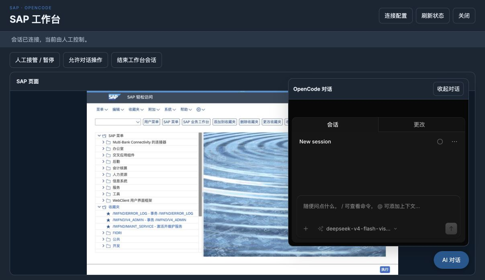

# 工作台覆盖浏览器视口

2026-10-04。按用户要求取消工作台外层限宽、外边距和圆角，窗口覆盖浏览器可用视口。程序仅改 `Scene/sap_workbench/frontend/workbench.css` 与对应的资源 SHA-256；右下角嵌入式 OpenCode、SAP 画面比例及输入映射保留。

Chrome 实测：浏览器可用视口为 1207×698，工作台边界为 x=0、y=0、width=1207、height=698，外边距和圆角均为 0。刷新宿主页后通过配置入口返回工作台，显式恢复原会话；仍显示已登录的 SAP Easy Access，保留人工控制状态及 AI 对话入口。保存的截图显示同一窗口内已展开的原生 OpenCode。未新建工作台会话、重启后端、输入凭据、执行 SAP 业务操作或发送模型消息。按原安排暂缓的实际业务/工具联调不在本次范围内。

资源路由回归：`.venv/bin/python -B -m pytest -q tests/test_sap_workbench.py::test_catalog_assets_and_scene_open_do_not_create_sessions`，**1 passed，0.64 秒**。本次未修改 JavaScript 或增加测试。

Web（9899）与桌面后端（9876）公共 CSS 均返回 200，响应字节与当前源码一致；两份 SAP 前端资源摘要匹配。`git diff --check` 与 `openspec validate add-sap-workbench-scene --strict` 通过。

