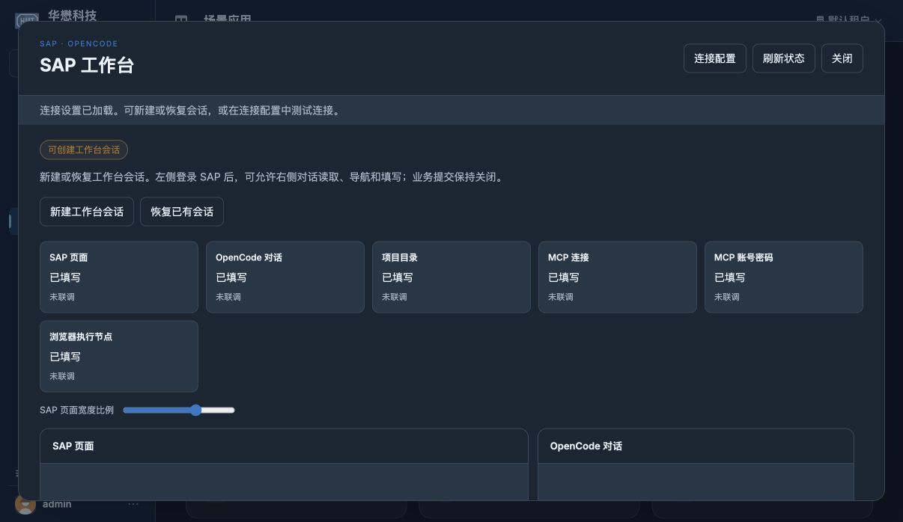

# 后续收尾与当前可执行范围

2026-10-04。完整计划推进至 **41/57，剩余 16 项**。本次完成 3.2 的原 API／配置合同复核，补齐已观察供应商 F4 弹窗的窄范围兼容，并重载两个源码后端。SAP Python 全套 **859 passed / 1 skipped，86.25 秒**。按用户安排，没有恢复 SAP Web GUI／OpenCode 的实际操作检查，没有调用真实模型或 MCP，没有保存业务。

## 本次完成

- **3.2 已完成**：获权管理员登记 SAP 目标、coding 授权、固定执行节点、封闭运行参数和逐次绑定核验满足原规范。独立复核确认无需额外新增 SAP 资源目录。新增 6 类地址／节点／target／coding／目录／服务覆盖参数拒绝，在分配前返回 400，保存配置和会话不变；真实临时平台配置／访问／输入专项 **78 passed，25.20 秒**。
- **F4 窄范围修复**：历史供应商搜索窗的完整 fallback 文本同时通过 label/text 校验后可建立 F4 归属并按 Escape 关闭。固定“集中删除标志”过滤标签不再误判为删除动作；查询、搜索输入、选值和页签仍拒绝。新观察必须完整且稳定，关闭继续核对原始内容、同代次与焦点链。31 个新用例包含在总套件中，见 [F4 兼容证据](f4-compatibility.md)。未从标签推断过滤值为空，也未将隔离验证称为现场兼容通过。
- **文档纠正**：当前配置账号／独立 GUI 登录与未来统一身份流程已分开；网关 registry 元数据不冒充 SAP 身份。跨时间桶精确退款保留为已知限制，不增设为本 change 的规范门槛；独立工具／模型生产授权仍属于未完成 5.5。
- **部署重试**：原固定 Debian 摘要的 build/pull 与 Docker 官方 ECR 副本都在 manifest HEAD 返回 EOF，未进入 APT／显示启动。新增 3 个实际临时进程／文件测试，与既有隔离部署专项合计 **45 passed**。Colima 恢复 Stopped、Docker context 恢复 default，用户缓存镜像和容器未操作，见 [Linux 部署重试](linux-display-retry.md)。4.1 没有勾选。

专项结果有重叠，78、101、45 等不与 859 相加。Node 153 和 Bun 3 项／68 assertions 沿用对应未修改前端与 host 的上一阶段结果；本次未重复完整 Node/Bun 回归。

## 原环境重载与入口核对

桌面后端 **58386 → 61515**，端口 9876，由原 Electron 29265 的既有恢复路径管理；Web **58422 → 61556**，端口 9899，沿原命令及完整进程环境重新启动。两个环境在私有内存中逐项比较一致，原数据根、密钥、租户根及 SAP 路径保留，没有输出其值，没有复制身份库、重置口令或更换密钥。

重载前工作台绑定均为 paused/manual，没有活动场景 runtime。重载后两个 health、chat、SAP JS/CSS、共享静态构建及匿名配置/会话拒绝共 **18 项通过**。SAP JS/CSS 与当前源码相同；共享 runtime 与上一完整静态构建一致。源文件摘要及进程/HTTP 证据见 [当前重载记录](incremental-services-reloaded.json)，上一轮原始记录保留为历史。

Chrome 通过正常产品界面刷新，原 admin／默认租户登录保留。场景卡片可打开，六组保存配置均显示“已填写”，新建/恢复入口可见；本次没有点击新建、恢复或测试连接，没有创建专属 Chrome/host，也没有进行 SAP 输入。桌面仍显示正常“在浏览器中登录”入口，没有验收登录后的双栏。

## 16 项未完成的明确条件

| 分类 | 任务 | 当前条件 |
| --- | --- | --- |
| 后续实现/部署，6 项 | 2.9、3.11、4.1、5.3、5.5、6.3 | 统一登录/可信 GUI 身份和生产授权沿已确认安排延后；Linux 上游读取失败；完整分页/页签及保存核验缺少实际控件、有效订单及回执合同 |
| 现场/负载验收，8 项 | 1.5、4.3、4.4、4.6、5.7、5.8、6.6、7.2 | 实际 SAP/OpenCode 操作测试已暂停；需要真实双 SAP 账号、控件/SSO/负载、有效单据和正常桌面登录后的验收 |
| 阶段汇总，2 项 | 1.7、4.7 | 依赖上述真实兼容与交互证据，不能用准备页或隔离测试替代 |

逐项源码与验收边界见 [范围复核](scope-closeout-review.md)。`submission_adapter=None`，真实保存执行器与完整业务 verifier 未注册，提交继续关闭。现有 read_table 的有限/截断结果与占位采购订单号不是完整订单核验合同；不盲接保存或把 unknown 当成功。普通“继续”请求不解除实际操作暂停，也不恢复早期强制同源密码要求。

这些是当前无法继续完成完整计划的具体条件。本次可独立处理的代码、测试、文档与后端加载已完成，不能声称 57 项全部完成或归档。

## 改动与验证边界

新程序变更集中在 `Scene/sap_workbench/browser_service/effects.py` 和 `page.py`；只更正既有 SAP `/browser` 路由注释，明确旧无绑定入口返回 410。新增 F4、显示进程专项及现有 session input 目标覆盖用例，文档只涉及本场景/change。普通 Agent、公共 IAM、其他场景、桌面主进程与参考 rsmcode 核心未改，其他既有工作区差异保留。

OpenSpec strict、Git diff 空白、123 个场景/change/SAP 专项文本、149 个本地文档/截图链接、3 项场景资产摘要及任务/剩余表格一致性均通过。重载后源文件摘要未变化；核心已跟踪差异为空，opencode 与 sap-connect 参考工作树干净。没有提交、推送或归档。
