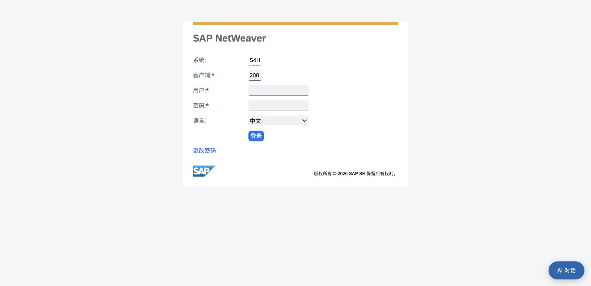
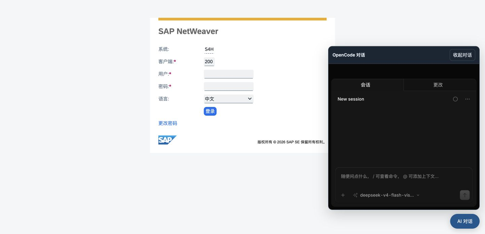

# 原生 SAP iframe 与新建会话替换

2026-10-04 用户要求「新建工作台会话时自动关闭已有会话」，随后确认「直接嵌入」。本轮落实两项要求，保留既有右下角嵌入式 OpenCode，对普通 Agent、OpenCode 核心及其他场景没有追加修改。

## 当前行为

- 新建/恢复返回服务端登记的 SAP URL，直接加载原生 iframe。没有 SAP 画面 WebSocket、canvas 或独立 Chrome 启动。原生 SAP iframe 占满工作区，OpenCode 面板默认收起，可反复展开且不重载它。
- 新建首先清理当前租户/账号的旧工作台 host、MCP 和旧浏览器资源，再检查容量并准备新 host。同账号的创建在当前进程串行；清理并行且有资源归属，同请求重试共用创建任务，HTTP 等待取消不打断清理。其他账号/租户不清理；旧历史、远端会话 ID 和不确定动作记录保留，被替换行终态 closed，不允许迟到请求重新打开。
- 原生模式不注册页面读取、导航、填写、滚动及提交工具，服务端也拒绝这些动作，避免工具操作不可见的 Chrome。配置 MCP 的只读工具独立于画面运行。该改变不证明 MCP 本轮现场重测或完整业务验证已通过。
- 旧数据增加 display_mode 列，缺省 screen 保留历史语义；通过当前恢复入口转换为 iframe，保留原项目/远端 ID。当前视图通过 heartbeat 保持 host 并发现被替换状态，关闭视图卸载 iframe，旧会话被替换后不自动重建。
- SAP cookie、证书、登录及防嵌入响应头由当前浏览器/SAP 管理。没有独立 profile 隔离保证，不移除响应头，不使用后端 TLS 例外绕过浏览器校验；跨域 iframe 不能由旧 CDP 工具控制。

## 验证

| 检查 | 本轮结果 |
| --- | --- |
| 完整 SAP Python 回归 | **1248 passed / 2 skipped，91.63 秒** |
| SAP、场景及 coding 前端 | **100 passed，86.35 ms**；SAP 前端其中 **53 passed** |
| 真实 canonical host 部署隔离 | **1 passed / 28 assertions，1.26 秒**；一个 iframe host、一个历史 screen host，验证配置工具权限、启动与会话访问；不发送提示词或调用模型 |
| 新生命周期专项 | 覆盖 owner 范围、全部旧行而非最近 50 条、清理先于分配、并发/重复请求、取消、清理失败、旧请求拒绝、旧行终态及历史恢复；native MCP 使用隔离回调验证，无实际 SAP 请求 |
| Web/桌面后端 | 沿完整原环境重载，9876/9899 健康均 200，原 Electron 继续持有桌面后端；没有新密钥、复制认证或密码重置 |
| 源码与静态资源 | 重载记录 **27 项源码摘要**匹配；两端 4 项 JS/CSS 字节匹配；SAP 三项资源清单摘要匹配 |
| Chrome SAP 实际入口 | 当前用户 Chrome 中 **SAP NetWeaver / S4H / Client 200 / 中文登录页**直接显示在工作台 iframe；外层 URI 仍 localhost:9899/chat。没有填写用户/密码或登录后的页面测试 |
| 原生全视口 | DOM 几何 **1441×698**，SAP iframe x/y **0/0**、宽高 **1441×698**，工作台 canvas 数量 **0** |
| Chrome OpenCode | 原生 Web 会话和空提示词框显示在浮动 iframe；展开/收起不发送消息，没有模型调用 |
| Chrome 再次新建 | 旧绑定 closed、新绑定 ready，账号活动绑定 **1**；旧 gateway 停止监听、旧 Bun host 被回收，新后台子进程只有 Bun，没有专属 Chrome |

现场生命周期元数据见 [会话检查](native-iframe-session-check.json)，部署及源码摘要见 [服务重载](native-iframe-services-reloaded.json)。第一个会话创建后旧记录 closed=18、ready=1；第二个会话创建后 closed=19、ready=1。关闭的是平台工作台运行资源，不宣称调用 SAP 注销或结束 SAP 服务端所有登录会话。

## 验收边界

登录页实际显示只证明入口嵌入成功，不证明登录后 SAP/SSO、cookie、全部交易及控件兼容。没有进行实际 SAP 导航、单据输入/保存或 OpenCode 模型工具操作，继续遵守用户暂缓安排。当前页面自动控制明确不可用，保留原后续控制与业务验收任务。

账号锁是进程内协调；跨进程并发创建尚未验证为全局串行。其他后端持有已关闭历史行时会在授权复验和监视器中关闭；本轮 Chrome 资源回收证据限定实际 Web 后端。桌面仅验证后端与公共资源，未宣称新的桌面登录及完整双端现场验收。

OpenSpec 严格校验、差异空白检查通过。完整计划仍 **42/57**，不以本轮 UI/生命周期检查勾选剩余 15 项，不归档。
