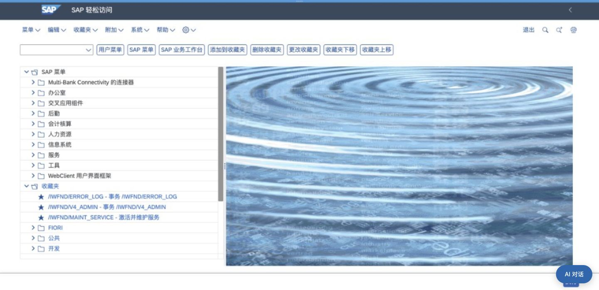
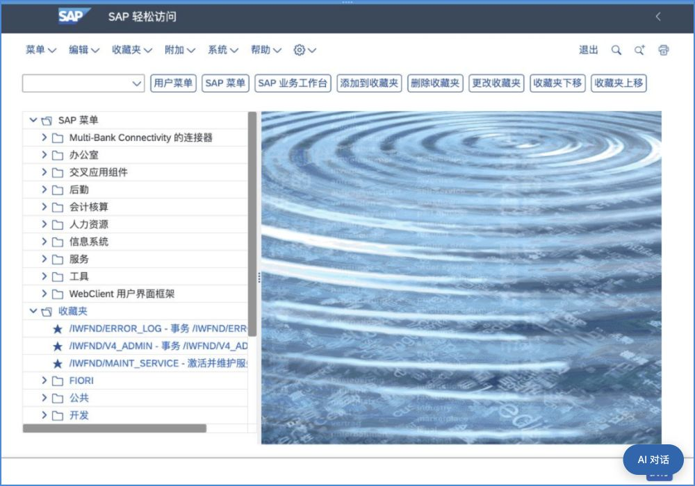

# SAP 视口跟随工作台，消除比例黑边

2026-10-04。之前只有显示容器铺满窗口，SAP 专属 Chrome 的固定视口与窗口比例不一致，`object-fit:contain` 留出黑边。本次增加真实页面视口同步，让 SAP 重新布局，保留画面比例和输入坐标映射；不是拉伸或裁切页面，也未替换为原生 SAP iframe。

修改范围：场景 frontend/workbench.js、browser_service 的 mapping/gateway/node/manager、backend/runtime.py、对应资源摘要及三份 SAP 专项测试。ResizeObserver/连接 open 合并尺寸更新（120ms），每轴接受 1..4096 整数，零尺寸/无效数据忽略，超大窗口同比缩小；同尺寸不重复发。旧 observer 与定时器在关闭/重连时清理。网关 resize 不作为文字或鼠标输入，绑定屏幕重新授权、布局变更撤销旧操作租约并串行调整。JPEG quality 提升为 80；实际传输仍受既有会话画面上限约束，不能宣称等同原生 HTML 清晰度。

验证：SAP 前端 **50 passed**；浏览器网关、manager 和 runtime 组合 **70 passed，2.39 秒**；公共资源入口 **1 passed，0.73 秒**。覆盖尺寸边界、合并/去重/零尺寸、关闭清理、网关更新后点击映射、拒绝撤权后的调整及旧布局租约撤销。

沿原完整环境重载 Web 与桌面后端，健康检查通过，见 [加载快照](viewport-size-services-reloaded.json)。当前视图先通过 Escape 正常关闭；数据库历史行保留，重载前没有 automatic 控制绑定。恢复最新绑定时另一工作台页已占用该画面，故关闭本次重复恢复视图，验证用户新打开的工作台页；未关闭用户其他窗口或修改数据库来解除占用。

Chrome 实测：当前已登录 SAP Easy Access，工作台显示尺寸与 SAP 帧视口同为 **1441×698**；临时调整到 **1000×700** 后二者同步为该尺寸，页面重新排版且无两侧黑边。验证后已撤销 viewport override。AI 对话展开/收起仍为原绑定的原生 OpenCode；未输入 SAP 凭据或业务数据、调用模型或 SAP 业务工具。实际业务验收仍按原安排暂缓。

