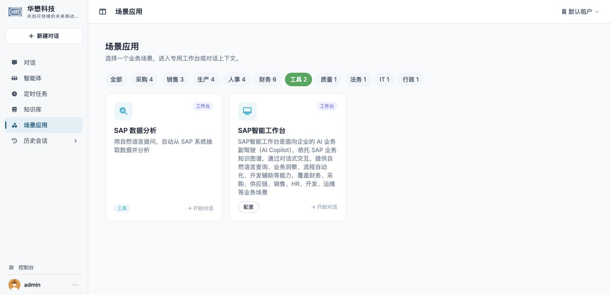

# 场景分类、名称与描述更新

2026-10-04，按用户最新文案要求完成：

- `data` 分类显示名「数据」改为「工具」，保留 ID 和筛选归属。
- `sap_workbench` 场景名、工作台标题改为「SAP智能工作台」；对应英文标题为 SAP Intelligent Workbench。
- 采用用户给出的 AI Copilot 完整描述，解码 HTML 实体、去除粘贴的 Markdown 标记。只对该 SAP 卡片取消两行截断，其他卡片保持原摘要布局。
- 场景 README 入口同步，SAP scene.json 和工作台 JS 摘要更新。没有改会话、MCP、普通智能体或 OpenCode 核心逻辑。

## 验证

- `node --test tests/test_scenes_frontend.cjs tests/test_sap_workbench_frontend.cjs`：65 pass / 0 fail。
- 两个修改的 JS 语法检查通过。
- Chrome 实际 `localhost:9899/chat`：选择「工具 2」后仍为原分类下两个场景，SAP 卡片显示新名称和全部描述。描述 clientHeight 与 scrollHeight 均为 140px，没有 line clamp，后半段可见。
- [Web / 桌面资源核对](scene-copy-resources.json)：9899 / 9876 均返回实际修改的两个 JS 源码，状态 200、摘要完全一致；三项 SAP 清单摘要全部匹配。最初探测 `/static` 返回 404，随后使用 Chrome 实际观察到的 `/assets` 地址完成核对，没有将错误探测地址记作产品故障。
- 进一步检查配置页时发现原组装 `/scene-assets/runtime.js` 存在进程级缓存，仍显示旧标题。关闭视图后[重载两个源码后端](scene-copy-services-reloaded.json)，保留完整原启动参数、环境和主密钥；桌面由原 Electron 恢复路径启动。重载后原组装脚本与源码摘要一致、含新标题且不含旧标题，两个后端健康 200，Chrome 配置页实际标题为「SAP智能工作台」。未新增登录凭据或改写权限。
- OpenSpec 严格校验通过，change 已同步名称、描述、当前导航失败结果，不归档。
- 对话导航测试另见 [实测记录](chat-navigation-test.md)；本轮文案修改不表示尚未通过的页面控制能力已经完成。

