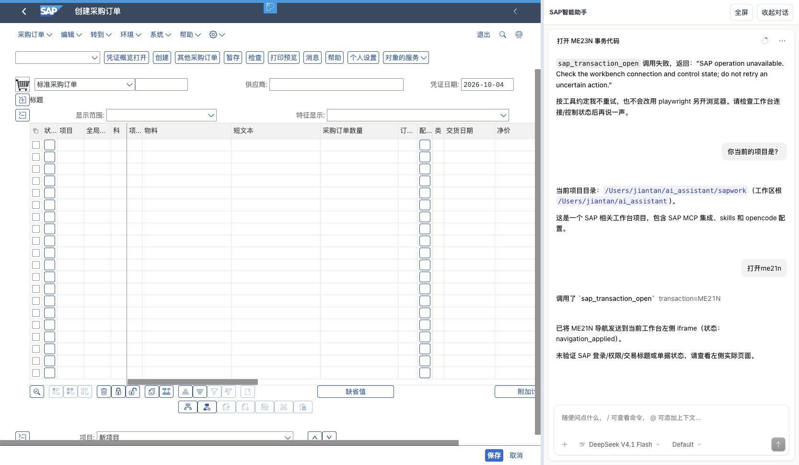

# 当前左侧 SAP 交易导航验收

日期：2026-10-04，Asia/Shanghai。Web 源后端 9899 已沿原命令和环境重载，保留主密钥、配置和原会话历史；见 [重载记录](source-reload.json)。

## 修复及现场原因

原生 OpenCode 的通用 Playwright 操作独立浏览器，与工作台左侧 SAP iframe 没有关联。场景新增 `sap_transaction_open`，只接受交易代码，从已保存 SAP URL 生成 `~transaction`，通过当前绑定的心跳交给父页面；更新原 SAP iframe 后确认接收，不新建页面，不重建右侧对话。

现场还发现两项必要兼容修复：当前 Web 使用原生 V1，V2 注册表中的工具不会自动出现在它的工具列表，因此项目插件同时接入 V1 server hook 和 V2 setup，保留当前协议及 message/part 历史。macOS loopback 接受 Bun 请求时设置 SO_KEEPALIVE 报 EINVAL，使工具桥前置连接超时；仅对场景网关关闭该内核选项，保留 HTTP 复用、认证、请求期限和工作台心跳。

V1 保留原生权限询问，V2 保留原生工具注册表。普通 OpenCode 进程中的插件不启用；未修改普通智能体执行器、OpenCode 源码或项目 opencode.json，也未限制原有模型、智能体、工具、技能和 MCP 配置。原对话中的失败记录保留为历史，本轮没有切换协议隐藏它们。

## Chrome 真实对话

在原 `localhost:9899/chat` 工作台，通过内嵌 OpenCode 发送普通自然语言请求，由真实模型选择并调用新增工具：

| 输入 | 左侧实测 | 标签页 | 结果 |
| --- | --- | --- | --- |
| 打开me21n | 原 SAP iframe 显示「创建采购订单」；src 含 `~transaction=ME21N` | 14 → 14，无新增 | 通过 |
| 打开me23n | 原 SAP iframe 显示标准采购订单页面；src 含 `~transaction=ME23N` | 14 → 14，无新增 | 通过 |

两次使用同一工作台标签页、绑定和 OpenCode 会话，未保存或填写单据。[ME21N 观察](me21n-observation.json)、[ME23N 观察](me23n-observation.json) 记录父页面 src 与浏览器标题检查；ME23N 单据号及创建者不写入证据。原生 V1 part 表的两个完成记录见 [工具回执](native-receipts.json)。

## 自动验证

- `.venv/bin/python -m pytest tests/test_sap_workbench*.py -q`：**1277 passed，2 skipped，93.98 秒**。覆盖绑定、动作准入、参数拒绝、重复确认、超时/关闭、迟到响应和现有 SAP 回归；跳过项不计为现场通过。
- `node --test tests/test_sap_workbench_frontend.cjs`：**57 passed，0 failed**，包含导航只应用一次、重复确认及过期/切换后响应拒绝。
- `SAP_OPENCODE_ROOT=/Users/jiantan/ai_assistant/rsmcode/opencode bun test Scene/sap_workbench/opencode_adapter/native-host.test.ts Scene/sap_workbench/opencode_adapter/navigation-guidance.test.ts`：**3 passed，0 failed，30 assertions**。实际原生 HTTP/V2 runner 使用替身供应商与桥，验证附加工具、原有 bash/read、两个项目模型、原指令和导航指引；直接执行 V1 hook 检查框架身份与原生权限调用。真实 V1 runner 验收以上面的 Chrome 对话为准。冷启动 V1 隔离 HTTP 测试曾因原生依赖安装等待超时，不计为通过，未保留该测试作为假通过用例。
- `Scene/source-manifest.json` 的三项 SAP 场景资源摘要全部匹配。
- `openspec validate fix-sap-workbench-iframe-navigation --strict --no-interactive`：通过。

## 能力边界

工具输出 `navigation_applied` 仅确认当前左侧已接收 URL 导航，`sap_page_verified` 与 `business_result_verified` 仍为 false。此次 Chrome 实测另行确认了两个交易页面；工具本身不能检查 SAP 登录、权限、字段或单据状态，也不提供保存、过账或删除能力。URL 重载可能要求重新登录或离开未保存草稿，不保证沿用相同 SAP 内部会话；其他交易、SSO 和跨域 DOM 操作未据此验收。

此前归档 change 的 15 项未完成范围及当时失败证据不变。本 change 仅完成有限的当前左侧交易导航修复。
